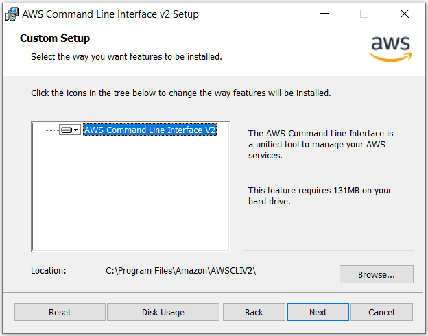
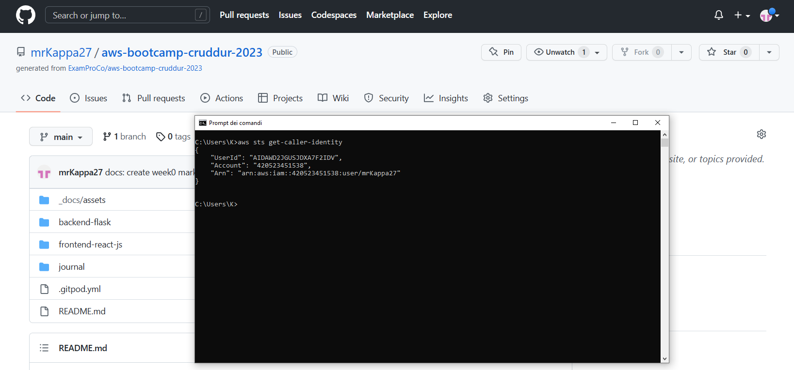
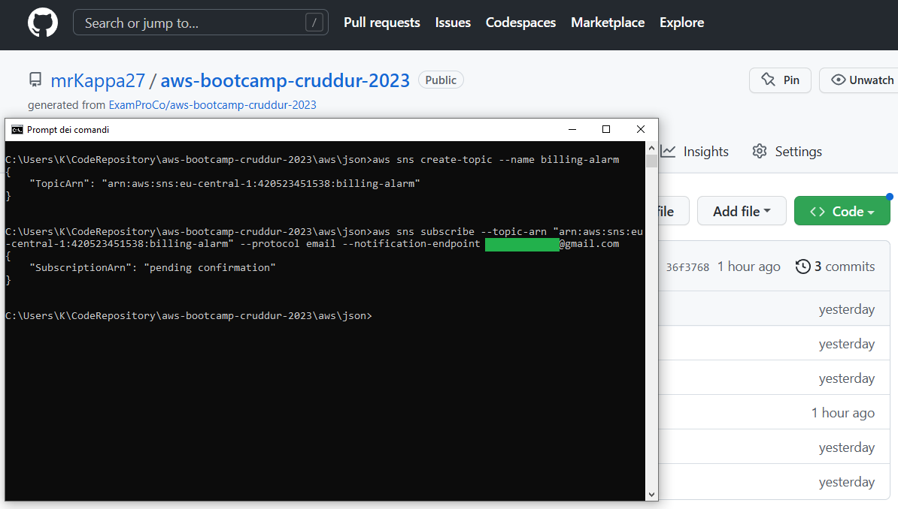

# Week 0 — Billing and Architecture

### TL;DR

I completed the assigned homework and doing that made me more aware about cost and budget that was for me an important point.
I set up my AWS cli with creds, created a budget, a billing alarm and secured my root account. Then I tested the AWS cloudshell I've always heard about but I've never tried. 

## Required Homeworks/Tasks

### Install AWS CLI

I couldn't use a remote development environment due to the fact that I already had my stuff set up on my laptop and I prefer not using external services if not higly suggested.
What I did was to download the AWS CLI v2 from the [official download page](https://awscli.amazonaws.com/AWSCLIV2.msi) and install it on my PC.



After that I configured the credentials (access key, secret and default region) with this command from the CLI:

`aws configure`

Here the proof of the `aws sts get-caller-identity`:




### Budgets

I both created a `Budget`via `AWS Console` and `AWS CLI`.

Here the command I used for the `AWS CLI`:

```
aws budgets create-budget --account-id 420523451538 --budget file://budget.json --notifications-with-subscribers file://budget-notifications.json
```

### Spending alarms

Before everything I enabled the option to `Receive Billing Alerts` in my AWS Root `Account Billing Page`.

I configured a budget of 5$ and an alarm via email with SNS.
This alarm is triggered when the daily expense forecast exceeds 2$.

List of commands used:

```
aws sns create-topic --name billing-alarm

aws sns subscribe --topic-arn "arn:aws:sns:eu-central-1:420523451538:billing-alarm" --protocol email --notification-endpoint foo@gmail.com

aws cloudwatch put-metric-alarm --cli-input-json file://alarm-config.json
```




### Recreate Logical Architecture Design

Finally I've created [my own version](https://lucid.app/lucidchart/dad239cd-7b78-4ea1-bcb5-a6f7b06bdfed/edit?viewport_loc=-1054%2C-79%2C3491%2C1744%2C0_0&invitationId=inv_8337ca52-bc68-4ba1-974e-c34a0fd9a480) of the AWS diagram with Lucidchart.


