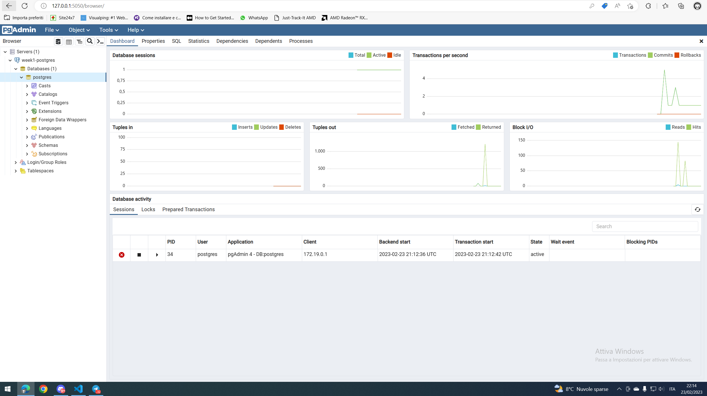
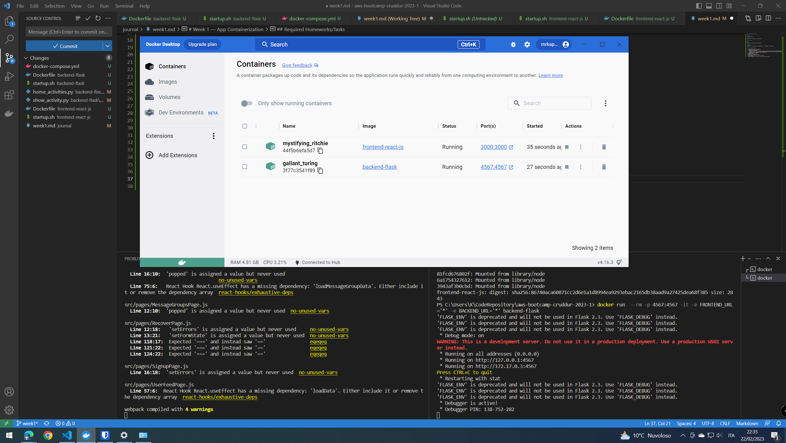
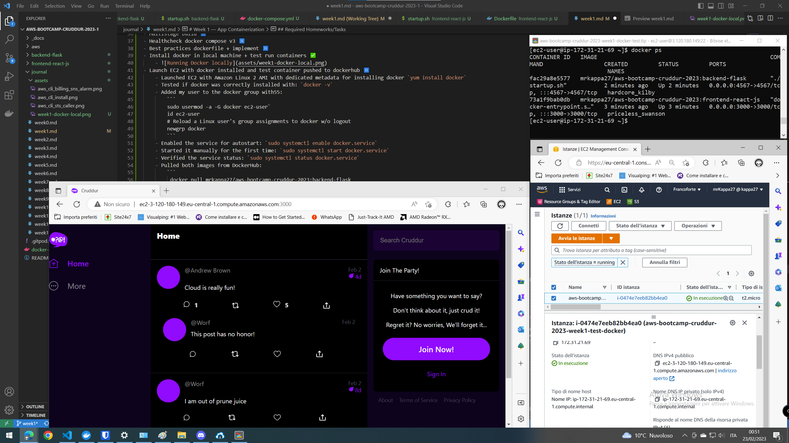

# Week 1 — App Containerization

### TL;DR
I followed the week1 live and went through all the todolist points (TODO: WIP) \
I completed the assigned homework and doing that made me more knowledgeable about Docker and app containerization in general. \
I set up Docker in my local environment, my DockerHub account, pushed the images we built during the week1 to dockerhub too. Then I went deeper about multistage builds, healthchecks and the best practices about dockerfiles and their implementation. \
Finally I ran the solution on and AWS EC2 instance on which I've installed docker, pulled the image from DockerHub, ran the two images and tested them. \
TODO: Notifications backend+frontend, dynamodb local, postgres container, healthchecks, finish best practices

## Build Container

### Backend 
```sh
docker build -t  backend-flask ./backend-flask
```

### Frontend 
```sh
docker build -t  frontend-react-js ./frontend-react-js
```

## Run Container

### Backend 
```sh
docker run --rm -p 4567:4567 -it backend-flask
```
Note: `-it` stands for interactive terminal

### Frontend 
```sh
docker run --rm -p 3000:3000 -d frontend-react-js
```
Note: `-d` stands for detached mode

### Env override
```sh
docker run  --rm -p 4567:4567 -it -e FRONTEND_URL='*' -e BACKEND_URL='*' backend-flask
```
## Add DynamoDB Local and Postgres

Add DynamoDB and Postgres to the `docker-compose`:

### Postgres

```yaml
services:
  db:
    image: postgres:13-alpine
    restart: always
    environment:
      - POSTGRES_USER=postgres
      - POSTGRES_PASSWORD=password
    ports:
      - '5432:5432'
    volumes: 
      - db:/var/lib/postgresql/data
volumes:
  db:
    driver: local
```

To install the postgres client I choosed to go with pgAdmin4 because I'm on a local environment and I think it can be interesting to test what I'm learning:
```yaml
services:
    pgadmin:
        container_name: pgadmin_container
        image: dpage/pgadmin4
        environment:
           - PGADMIN_DEFAULT_EMAIL: ${PGADMIN_DEFAULT_EMAIL:-pgadmin4@pgadmin.org}
           - PGADMIN_DEFAULT_PASSWORD: ${PGADMIN_DEFAULT_PASSWORD:-admin}
           - PGADMIN_CONFIG_SERVER_MODE: 'False'
        volumes:
           - pgadmin:/var/lib/pgadmin
        ports:
           - "${PGADMIN_PORT:-5050}:80"
        networks:
           - postgres
        restart: unless-stopped
```


### DynamoDB Local

```yaml
services:
  dynamodb-local:
    # https://stackoverflow.com/questions/67533058/persist-local-dynamodb-data-in-volumes-lack-permission-unable-to-open-databa
    # We needed to add user:root to get this working.
    user: root
    command: "-jar DynamoDBLocal.jar -sharedDb -dbPath ./data"
    image: "amazon/dynamodb-local:latest"
    container_name: dynamodb-local
    ports:
      - "8000:8000"
    volumes:
      - "./docker/dynamodb:/home/dynamodblocal/data"
    working_dir: /home/dynamodblocal
```

Example of using DynamoDB local
https://github.com/100DaysOfCloud/challenge-dynamodb-local

## Volumes

directory volume mapping

```yaml
volumes: 
- "./docker/dynamodb:/home/dynamodblocal/data"
```

named volume mapping

```yaml
volumes: 
  - db:/var/lib/postgresql/data

volumes:
  db:
    driver: local
```

## Required Homeworks/Tasks

- Run the dockerfile CMD as external script ✅
    - Remember: shebang and export PATH
- Push and tag the image to DockerHub ✅
    - Followed [official documentation](https://docs.docker.com/docker-hub/repos/#:~:text=To%20push%20an%20image%20to,docs%2Fbase%3Atesting%20).)
    - Created a new [public repository](https://hub.docker.com/repository/docker/mrkappa27/aws-bootcamp-cruddur-2023/general) on DockerHub
    - Tagged both images (retagged the already existing image)
    - Pushed the images to DockerHub
- Multistage build ✅
    - Remember:
        - [Official docs](https://docs.docker.com/build/building/multi-stage/)
        - useful for reducing image size and not shipping development/build dependecies in a production image (more secure)
        - possible to use different `FROM` images
- Healthcheck Docker compose v3 ✅
    - Remember: 
        - check or install `wget` or `curl` on the container image
        - check that your docker-compose file format is >= v3.0
        - adjust timeouts, retry, intervals and __start_period__ ( >= v3.4)
        - `docker ps` easily shows you the healtcheck status in between (parentheses)
    - Note: Go deeper about python multi stage builds best practices (tip: VENVs)
- Best practices dockerfile and implementation ⏸️
- Install Docker in local machine + test run containers ✅
    - 
- Launch EC2 with Docker installed and test container pushed to dockerhub ✅
    - Launched EC2 with Amazon Linux 2 AMI with dedicated metadata for installing docker `yum install docker`
    - Tested if Docker was correctly installed with: `docker -v` 
    - Added my user to the Docker group with:
        ```
        sudo usermod -a -G docker ec2-user`
        id ec2-user
        # Reload a Linux user's group assignments to Docker w/o logout
        newgrp docker
        ```
    - Enabled the service for autostart: `sudo systemctl enable docker.service`
    - Started it manually for the first time: `sudo systemctl start docker.service`
    - Verified the service status: `sudo systemctl status docker.service`
    - Pulled both images from DockerHub:
        ```
         docker pull mrkappa27/aws-bootcamp-cruddur-2023:backend-flask
         docker pull mrkappa27/aws-bootcamp-cruddur-2023:frontend-react-js
        ```
    - Ran the images but on EC2:
         ```
         docker run  --rm -p 3000:3000 -e REACT_APP_BACKEND_URL='http://ec2-3-120-180-149.eu-central-1.compute.amazonaws.com:4567' -d mrkappa27/aws-bootcamp-cruddur-2023:frontend-react-js
         docker run  --rm -p 4567:4567 -d -e FRONTEND_URL='*' -e BACKEND_URL='*' mrkappa27/aws-bootcamp-cruddur-2023:backend-flask
        ```   
    - 