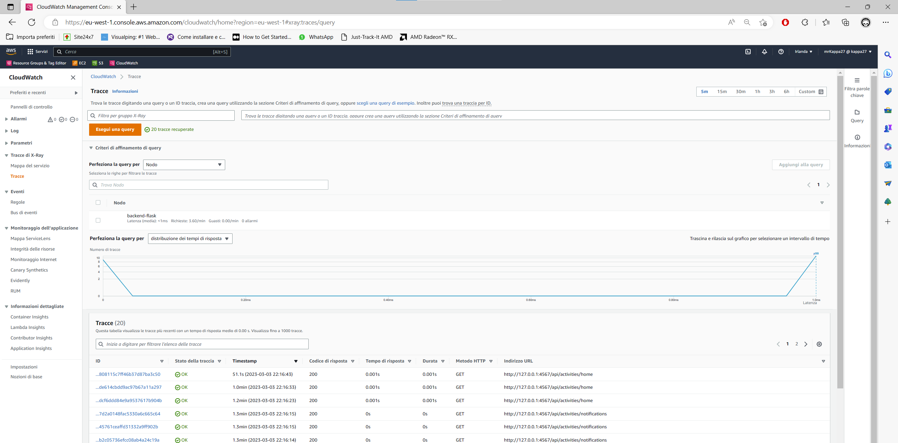
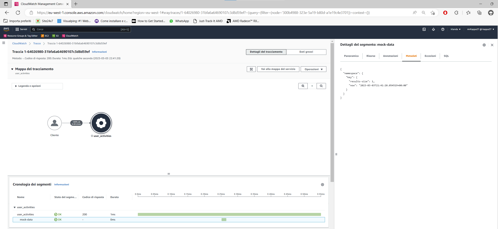
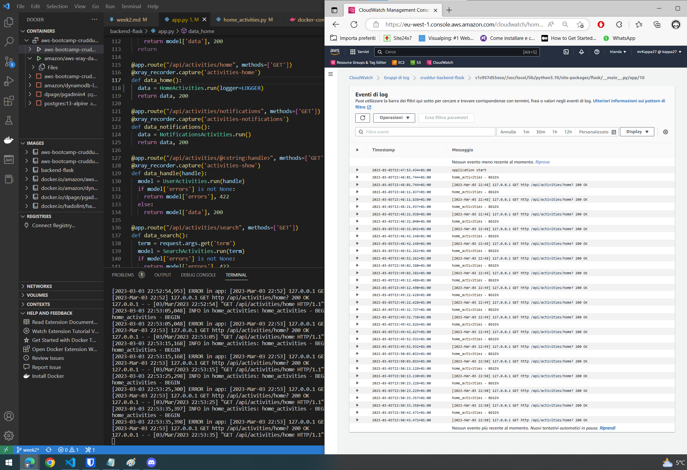

# Week 2 — Distributed Tracing

### TL;DR
I do apologize for having used branches, from the next week I'll stick to committing to the `main` branch.
I followed the week2 live and went through all the todolist points \
I completed the assigned homework and doing that made me more knowledgeable about distributed tracing. I didn't know much about this topic and it has been a very interesting week. \
I registered a free tier account on Honeycomb and sent the traces to that service + did all the tasks you did on the live.
I configured AWS X-Ray for receiving the traces from the application + did extra steps as shown in the follow up video.
TODO: Rollbar, CWLogs

## HoneyComb
Follow the Honeycomb instructions for creating a new dataset in Python.
Remember to follow the [opentelemetry docs](https://docs.honeycomb.io/getting-data-in/opentelemetry/python/)

Add the following modules to our `requirements.txt`

```
opentelemetry-api 
opentelemetry-sdk 
opentelemetry-exporter-otlp-proto-http 
opentelemetry-instrumentation-flask 
opentelemetry-instrumentation-requests
```

Install these deps:

```sh
pip install -r requirements.txt
```

Add to the `app.py`

```py
from opentelemetry import trace
from opentelemetry.instrumentation.flask import FlaskInstrumentor
from opentelemetry.instrumentation.requests import RequestsInstrumentor
from opentelemetry.exporter.otlp.proto.http.trace_exporter import OTLPSpanExporter
from opentelemetry.sdk.trace import TracerProvider
from opentelemetry.sdk.trace.export import BatchSpanProcessor
```


```py
# Initialize tracing and an exporter that can send data to Honeycomb
provider = TracerProvider()
processor = BatchSpanProcessor(OTLPSpanExporter())
provider.add_span_processor(processor)
trace.set_tracer_provider(provider)
tracer = trace.get_tracer(__name__)
```

Note: __Do not have 2 `app = Flask(__name__)`__
```py
# Initialize automatic instrumentation with Flask
app = Flask(__name__)
FlaskInstrumentor().instrument_app(app)
RequestsInstrumentor().instrument()
```

Add the following Env Vars to `backend-flask` in docker compose

```yml
OTEL_EXPORTER_OTLP_ENDPOINT: "https://api.honeycomb.io"
OTEL_EXPORTER_OTLP_HEADERS: "x-honeycomb-team=${HONEYCOMB_API_KEY}"
OTEL_SERVICE_NAME: "${HONEYCOMB_SERVICE_NAME}"
```

Fetch the API key from the honeycomb account:

```sh
export HONEYCOMB_API_KEY="myhoneycombkey"
export HONEYCOMB_SERVICE_NAME="Cruddur"
```

__NOTE__: I'm working in a local environment so I had to export them. I stored this env vars in a `.env` file that I added to the `.gitignore` for not pushing this file to the public repository on GitHub.

### Proofs:


### Vocabulary
[Observability 101 terminology and concepts](https://www.honeycomb.io/blog/observability-101-terminology-and-concepts)

## AWS X-Ray
AWS equivalent to Honeycomb

### Instrument AWS X-Ray for Flask

```sh
export AWS_REGION="eu-west-1"
gp env AWS_REGION="eu-west-1"
```

Add to the `requirements.txt`:
```py
aws-xray-sdk
```

Install python dependencies:
```sh
pip install -r requirements.txt
```

Add to `app.py`
```py
from aws_xray_sdk.core import xray_recorder
from aws_xray_sdk.ext.flask.middleware import XRayMiddleware

xray_url = os.getenv("AWS_XRAY_URL")
xray_recorder.configure(service='Cruddur', dynamic_naming=xray_url)
XRayMiddleware(app, xray_recorder)
```

### Setup AWS X-Ray Resources

Add `aws/json/xray.json`

```json
{
  "SamplingRule": {
      "RuleName": "Cruddur",
      "ResourceARN": "*",
      "Priority": 9000,
      "FixedRate": 0.1,
      "ReservoirSize": 5,
      "ServiceName": "Cruddur",
      "ServiceType": "*",
      "Host": "*",
      "HTTPMethod": "*",
      "URLPath": "*",
      "Version": 1
  }
}
```

```sh
FLASK_ADDRESS="https://4567-${GITPOD_WORKSPACE_ID}.${GITPOD_WORKSPACE_CLUSTER_HOST}"
aws xray create-group \
   --group-name "Cruddur" \
   --filter-expression "service(\"backend-flask\")"
```
NOTE: For seeing what we created in the console go to Cloudwatch Logs - Settings - X-Ray Traces - Groups settings

```sh
aws xray create-sampling-rule --cli-input-json file://aws/json/xray.json
```
NOTE: For seeing what we created in the console go to Cloudwatch Logs - Settings - X-Ray Traces - Sampling rules

Sample output:
```sh
{
    "SamplingRuleRecord": {
        "SamplingRule": {
            "RuleName": "Cruddur",
            "RuleARN": "arn:aws:xray:eu-west-1:123456781538:sampling-rule/Cruddur",
            "ResourceARN": "*",
            "Priority": 9000,
            "FixedRate": 0.1,
            "ReservoirSize": 5,
            "ServiceName": "backend-flask",
            "ServiceType": "*",
            "Host": "*",
            "HTTPMethod": "*",
            "URLPath": "*",
            "Version": 1,
            "Attributes": {}
        },
        "CreatedAt": "2023-03-03T21:48:21+01:00",
        "ModifiedAt": "2023-03-03T21:48:21+01:00"
    }
}
```

How to install the daemon:
[Install X-ray Daemon](https://docs.aws.amazon.com/xray/latest/devguide/xray-daemon.html)

[Github aws-xray-daemon](https://github.com/aws/aws-xray-daemon)
[X-Ray Docker Compose example](https://github.com/marjamis/xray/blob/master/docker-compose.yml)

Command for installing the daemon on an EC2 or equivalent solution
```sh
 wget https://s3.us-east-2.amazonaws.com/aws-xray-assets.us-east-2/xray-daemon/aws-xray-daemon-3.x.deb
 sudo dpkg -i **.deb
 ```

### Proofs:



### Add Deamon Service to Docker Compose

```yml
  xray-daemon:
    image: "amazon/aws-xray-daemon"
    environment:
      AWS_ACCESS_KEY_ID: "${AWS_ACCESS_KEY_ID}"
      AWS_SECRET_ACCESS_KEY: "${AWS_SECRET_ACCESS_KEY}"
      AWS_REGION: "us-east-1"
    command:
      - "xray -o -b xray-daemon:2000"
    ports:
      - 2000:2000/udp
```

We have to add two env vars to our backend-flask in our `docker-compose.yml` file

```yml
      AWS_XRAY_URL: "*localhost*"
      AWS_XRAY_DAEMON_ADDRESS: "xray-daemon:2000"
```

### Check service data for last 10 minutes

```sh
EPOCH=$(date +%s)
aws xray get-service-graph --start-time $(($EPOCH-600)) --end-time $EPOCH
```

## Cloud Watch Logs

Add to the `requirements.txt`
```
watchtower
```

Install python dependencies:
```sh
pip install -r requirements.txt
```

In `app.py`

```
import watchtower
import logging
from time import strftime
```

```py
# Configuring Logger to Use CloudWatch
LOGGER = logging.getLogger(__name__)
LOGGER.setLevel(logging.DEBUG)
console_handler = logging.StreamHandler()
cw_handler = watchtower.CloudWatchLogHandler(log_group='cruddur-backend-flask')
LOGGER.addHandler(console_handler)
LOGGER.addHandler(cw_handler)
LOGGER.info("some message")
```

Add this block for catching all the requests:
```py
@app.after_request
def after_request(response):
    timestamp = strftime('[%Y-%b-%d %H:%M]')
    LOGGER.error('%s %s %s %s %s %s', timestamp, request.remote_addr, request.method, request.scheme, request.full_path, response.status)
    return response
```

We'll log something in an API endpoint
```py
LOGGER.info('home_activities - BEGIN')
```

Set the env var in your backend-flask for `docker-compose.yml`

```yml
      AWS_DEFAULT_REGION: "${AWS_DEFAULT_REGION}"
      AWS_ACCESS_KEY_ID: "${AWS_ACCESS_KEY_ID}"
      AWS_SECRET_ACCESS_KEY: "${AWS_SECRET_ACCESS_KEY}"
```

__NOTE__: passing AWS_REGION doesn't seems to get picked up by boto3 so pass default region instead

__TIP__: set Log group retention to a short value (eg. 1 week) so you can avoid spending for keeping old logs

### Proofs:


## Rollbar

## Required Homeworks/Tasks
- Completed all the todo and technical tasks ⏰
- Add AWS X-Ray segments and sub-segments ✅
    - Remember to add capture annotation + close segments and subsegments
    
- Instrument Honeycomb for the frontend-application to observe network latency between frontend and backend[HARD] ⏰
    - Hypothesis solution A: use and leverage the [trace context header](https://www.w3.org/TR/trace-context/). Basically I need to find a way for adding this header in every request that the frontend sends to the backend. Doing that we can follow a trace from the frontend to the backend, between that I expect to see the network latency too. (Sounds more clean and complete)
    - Hypothesis solution B: atach to each request a header with the UTC timestamp of the request. With that information it will be easy to calculate the difference between the moment of the request reception and the starting request timestamp. (Basic implementation)
    - How we can be sure about what the client is reporting? Both timestamps and data.
- Add custom instrumentation to Honeycomb to add more attributes eg. UserId, Add a custom span ✅
    - app.user_id: at the moment is just a random number but I think in the next week we can put here a proper UserId. This will be useful in case of troubleshooting an issue with a specific user.
    - app.result_lenght_byte: this is calculated from our mock data result. In a real-world scenario it can be useful to monitor how many data I'm returning. Checking this value may lead to implement pagination on this endpoint or to catch heavy responses. This attribute united with the UserId can help us to spot who's getting so much result data in a response.
    
- Run custom queries in Honeycomb and save them later eg. Latency by UserID, Recent Traces ✅
    Created a Board and saved my queries on it:
    - Average latency by UserID
    - Recent traces
    - Recently active users
    These can be useful for monitoring and for checking the general status of the Cruddr app.
    
