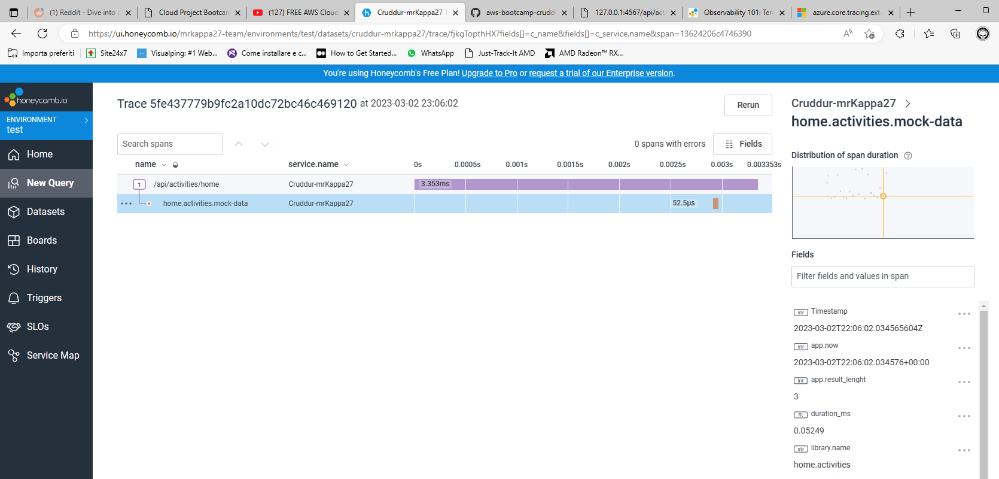
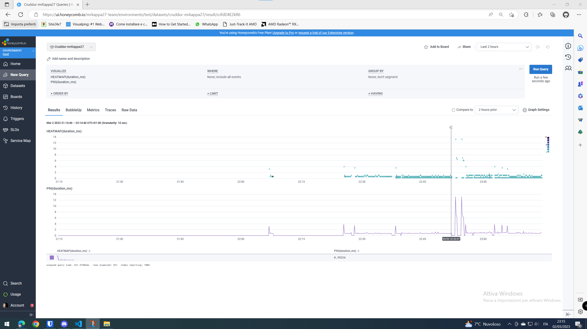
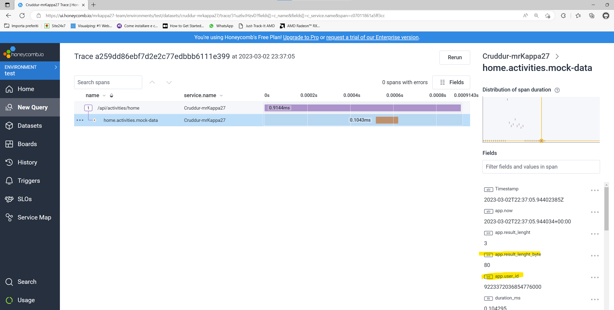
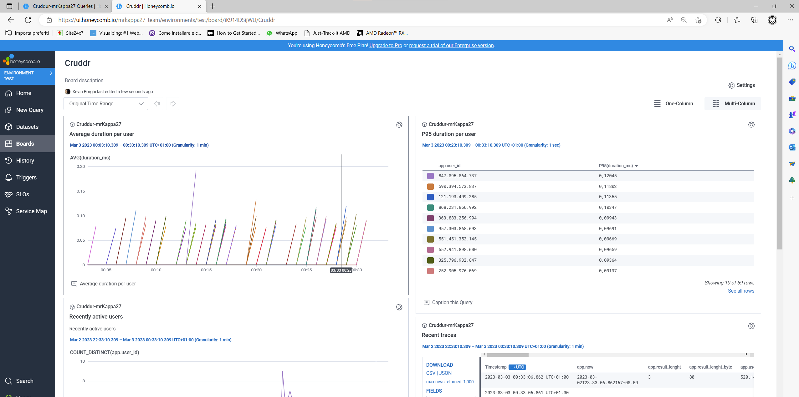

# Week 2 — Distributed Tracing

### TL;DR
I followed the week2 live and went through all the todolist points \
I completed the assigned homework and doing that made me more knowledgeable about distributed tracing. I didn't know much about this topic and it has been a very interesting week. \
TODO: Honeycomb registration + implement + other services.

## HoneyComb
Follow the Honeycomb instructions for creating a new dataset in Python.
Remember to follow the [opentelemetry docs](https://docs.honeycomb.io/getting-data-in/opentelemetry/python/)

Add the following modules to our `requirements.txt`

```
opentelemetry-api 
opentelemetry-sdk 
opentelemetry-exporter-otlp-proto-http 
opentelemetry-instrumentation-flask 
opentelemetry-instrumentation-requests
```

Install these deps:

```sh
pip install -r requirements.txt
```

Add to the `app.py`

```py
from opentelemetry import trace
from opentelemetry.instrumentation.flask import FlaskInstrumentor
from opentelemetry.instrumentation.requests import RequestsInstrumentor
from opentelemetry.exporter.otlp.proto.http.trace_exporter import OTLPSpanExporter
from opentelemetry.sdk.trace import TracerProvider
from opentelemetry.sdk.trace.export import BatchSpanProcessor
```


```py
# Initialize tracing and an exporter that can send data to Honeycomb
provider = TracerProvider()
processor = BatchSpanProcessor(OTLPSpanExporter())
provider.add_span_processor(processor)
trace.set_tracer_provider(provider)
tracer = trace.get_tracer(__name__)
```

Note: __Do not have 2 `app = Flask(__name__)`__
```py
# Initialize automatic instrumentation with Flask
app = Flask(__name__)
FlaskInstrumentor().instrument_app(app)
RequestsInstrumentor().instrument()
```

Add the following Env Vars to `backend-flask` in docker compose

```yml
OTEL_EXPORTER_OTLP_ENDPOINT: "https://api.honeycomb.io"
OTEL_EXPORTER_OTLP_HEADERS: "x-honeycomb-team=${HONEYCOMB_API_KEY}"
OTEL_SERVICE_NAME: "${HONEYCOMB_SERVICE_NAME}"
```

Fetch the API key from the honeycomb account:

```sh
export HONEYCOMB_API_KEY="myhoneycombkey"
export HONEYCOMB_SERVICE_NAME="Cruddur"
```

__NOTE__: I'm working in a local environment so I had to export them. I stored this env vars in a `.env` file that I added to the `.gitignore` for not pushing this file to the public repository on GitHub.

### Proofs:



### Vocabulary
[Observability 101 terminology and concepts](https://www.honeycomb.io/blog/observability-101-terminology-and-concepts)

## Required Homeworks/Tasks
- Completed all the todo and technical tasks ⏰
- Instrument Honeycomb for the frontend-application to observe network latency between frontend and backend[HARD] ⏰
    - Hypothesis solution A: use and leverage the [trace context header](https://www.w3.org/TR/trace-context/). Basically I need to find a way for adding this header in every request that the frontend sends to the backend. Doing that we can follow a trace from the frontend to the backend, between that I expect to see the network latency too. (Sounds more clean and complete)
    - Hypothesis solution B: atach to each request a header with the UTC timestamp of the request. With that information it will be easy to calculate the difference between the moment of the request reception and the starting request timestamp. (Basic implementation)
    - How we can be sure about what the client is reporting? Both timestamps and data.
- Add custom instrumentation to Honeycomb to add more attributes eg. UserId, Add a custom span ✅
    - app.user_id: at the moment is just a random number but I think in the next week we can put here a proper UserId. This will be useful in case of troubleshooting an issue with a specific user.
    - app.result_lenght_byte: this is calculated from our mock data result. In a real-world scenario it can be useful to monitor how many data I'm returning. Checking this value may lead to implement pagination on this endpoint or to catch heavy responses. This attribute united with the UserId can help us to spot who's getting so much result data in a response.
    
- Run custom queries in Honeycomb and save them later eg. Latency by UserID, Recent Traces ✅
    Created a Board and saved my queries on it:
    - Average latency by UserID
    - Recent traces
    - Recently active users
    These can be useful for monitoring and for checking the general status of the Cruddr app.
    
