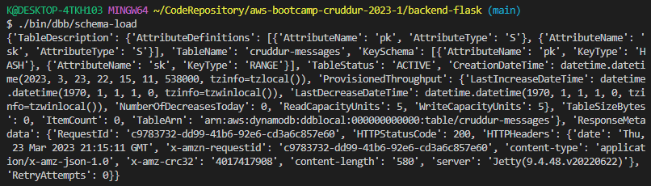
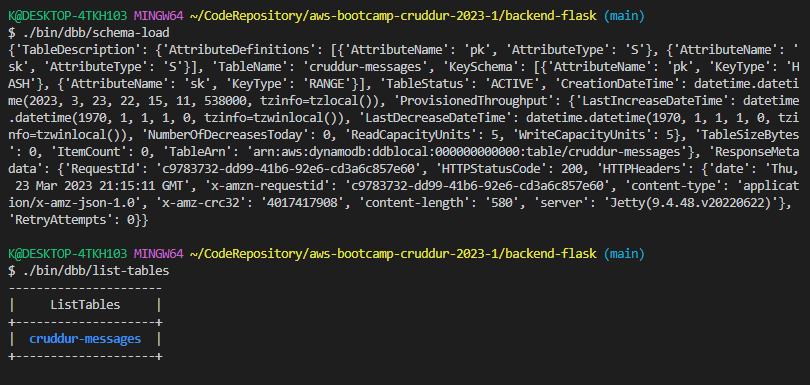
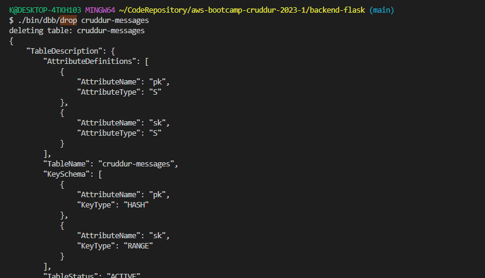
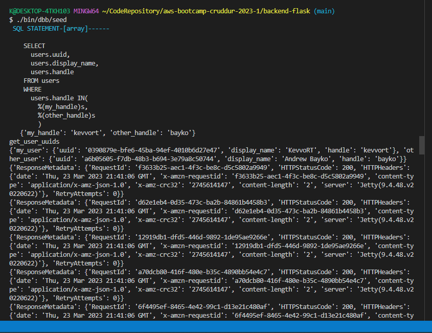
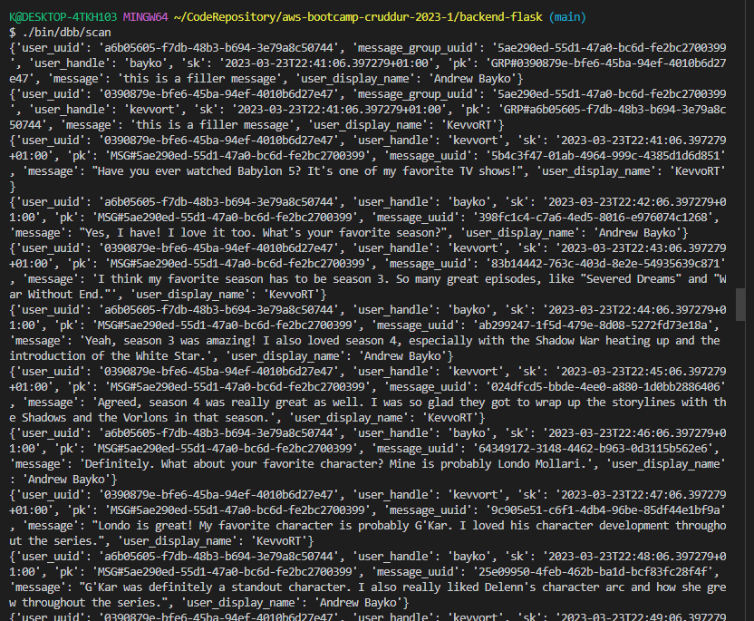
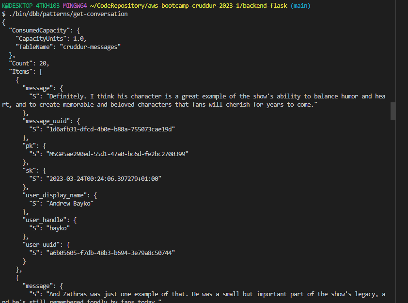
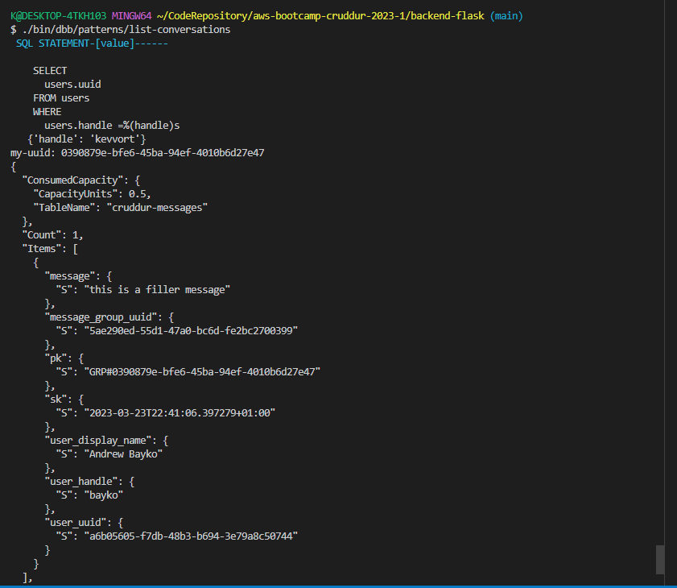

# Week 5 — DynamoDB and Serverless Caching

## TL;DR
Data Modelling a Direct Messaging System using Single Table Design
Implementing DynamoDB query using Single Table Design
Provisioning DynamoDB tables with Provisioned Capacity
Utilizing a Global Secondary Index (GSI) with DynamoDB
Rapid data modelling and implementation of DynamoDB with DynamoDB Local
Writing utility scripts to easily setup and teardown and debug DynamoDB data
## Live Video Core points:

- Define access patterns and validate them against your partition key and sort key 
- NoSql structure design
- GSI vs LSI
- Remember costs, scanning and performance
- Data/fields are cheaper than a missing info that requires full scans or calcs
- call pk the partition key and sk the sort key
- one pattern can also be using a data key (dump key) useful for GSI. You can even store a full JSON in there.
- Start from most common patterns and try to use the few numbers GSI keys. Avoid full scans and try to use up to 1-2 GSIs
- If you're not indexing that field you can put all together in a JSON object in a generic 'data' field
- 'MSG#DATE' or 'GRP#DATE' can be a pattern to tinker with "BEGIN WITH" and leverage the benefits of single table design
- it's ok in a NoSQL db to duplicate data if it's necessary for your patterns. "It's not a sin" cit. 

Schema load proof

Schema load+list tables proof

Drop

Seeds

Scan

Get conversations

Get conversations

## Required Homeworks/Tasks
- Completed all the todo and technical tasks 
- Data Modelling a Direct Messaging System using Single Table Design
- Implementing DynamoDB query using Single Table Design
- Provisioning DynamoDB tables with Provisioned Capacity
- Utilizing a Global Secondary Index (GSI) with DynamoDB
- Rapid data modelling and implementation of DynamoDB with DynamoDB Local
- Writing utility scripts to easily setup and teardown and debug DynamoDB data
