# Week 5 — DynamoDB and Serverless Caching

## TL;DR
- Data Modelling a Direct Messaging System using Single Table Design
- Implementing DynamoDB query using Single Table Design
- Provisioning DynamoDB tables with Provisioned Capacity
- Utilizing a Global Secondary Index (GSI) with DynamoDB
- Rapid data modelling and implementation of DynamoDB with DynamoDB Local
- Writing utility scripts to easily setup and teardown and debug DynamoDB data

## Live Video Core points:

- Define access patterns and validate them against your partition key and sort key 
- NoSql structure design
- GSI vs LSI
- Remember costs, scanning and performance
- Data/fields are cheaper than a missing info that requires full scans or calcs
- Call pk the partition key and sk the sort key
- One pattern can also be using a data key (dump key) useful for GSI. You can even store a full JSON in there.
- Start from most common patterns and try to use the few numbers GSI keys. Avoid full scans and try to use up to 1-2 GSIs
- If you're not indexing that field you can put all together in a JSON object in a generic 'data' field
- 'MSG#DATE' or 'GRP#DATE' can be a pattern to tinker with "BEGIN WITH" and leverage the benefits of single table design
- It's ok in a NoSQL db to duplicate data if it's necessary for your patterns. "It's not a sin" cit. 

## DynamoDB Bash Scripts

```sh
./bin/ddb/schema-load
```

## The Boundaries of DynamoDB

- When you write a query you have provide a Primary Key (equality) eg. pk = 'andrew'
- Are you allowed to "update" the Hash and Range?
  - No, whenever you change a key (simple or composite) eg. pk or sk you have to create a new item.
    - you have to delete the old one
- Key condition expressions for query only for RANGE, HASH is only equality 
- Don't create UUID for entity if you don't have an access pattern for it


3 Access Patterns

## Pattern A  (showing a single conversation)

A user wants to see a list of messages that belong to a message group
The messages must be ordered by the created_at timestamp from newest to oldest (DESC)

```sql
SELECT
  messages.uuid,
  messages.display_name,
  messages.message,
  messages.handle,
  messages.created_at -- sk
FROM messages
WHERE
  messages.message_group_uuid = {{message_group_uuid}} -- pk
ORDER BY messages.created_at DESC
```

> message_group_uuid comes from Pattern B

## Pattern B (list of conversation)

A user wants to see a list of previous conversations.
These conversations are listed from newest to oldest (DESC)
We want to see the other person we are talking to.
We want to see the last message (from whomever) in summary.

```sql
SELECT
  message_groups.uuid,
  message_groups.other_user_uuid,
  message_groups.other_user_display_name,
  message_groups.other_user_handle,
  message_groups.last_message,
  message_groups.last_message_at
FROM message_groups
WHERE
  message_groups.user_uuid = {{user_uuid}} --pk
ORDER BY message_groups.last_message_at DESC
```

> We need a Global Secondary Index (GSI)

## Pattern C (create a message)

```sql
INSERT INTO messages (
  user_uuid,
  display_name,
  handle,
  creaed_at
)
VALUES (
  {{user_uuid}},
  {{display_name}},
  {{handle}},
  {{created_at}}
);
```

## Pattern D (update a message_group for the last message)

When a user creates a message we need to update the conversation
to display the last message information for the conversation

```sql
UPDATE message_groups
SET 
  other_user_uuid = {{other_user_uuid}}
  other_user_display_name = {{other_user_display_name}}
  other_user_handle = {{other_user_handle}}
  last_message = {{last_message}}
  last_message_at = {{last_message_at}}
WHERE 
  message_groups.uuid = {{message_group_uuid}}
  AND message_groups.user_uuid = {{user_uuid}}
```


## Serverless Caching (Skipped)

### Install Momento CLI tool

In your gitpod.yml file add:

```yml
  - name: momento
    before: |
      brew tap momentohq/tap
      brew install momento-cli
```

### Login to Momento (Skipped)

There is no `login` you just have to generate an access token and not lose it. 
 
You cannot rotate out your access token on an existing cache.

If you lost your cache or your cache was comprised you just have to wait for the TTL to expire.

> It might be possible to rotate out the key by specifcing the same cache name and email.

 ```sh
 momento account signup aws --email andrew@exampro.co --region us-east-1
 ```

### Create Cache (Skipped)

```sh
export MOMENTO_AUTH_TOKEN=""
export MOMENTO_TTL_SECONDS="600"
export MOMENTO_CACHE_NAME="cruddur"
gp env MOMENTO_AUTH_TOKEN=""
gp env MOMENTO_TTL_SECONDS="600"
gp env MOMENTO_CACHE_NAME="cruddur"
```

> you might need to do `momento configure` since it might not pick up the env var in the CLI.

Create the cache:

```sh
momento cache create --name cruddur
```
### DynamoDB Stream trigger to update message groups

Table created:

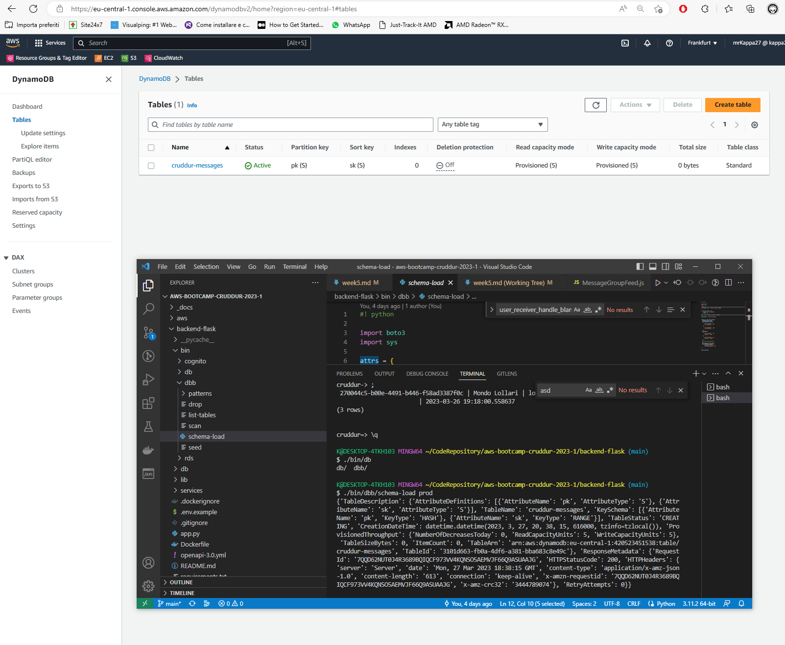

- create a VPC endpoint for dynamoDB service on your VPC 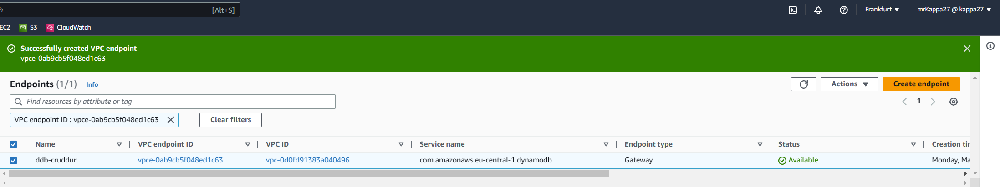
- create a Python lambda function in your VPC 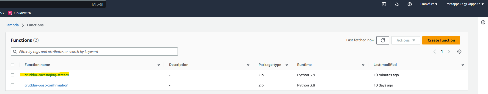
- enable streams on the table with 'new image' attributes included 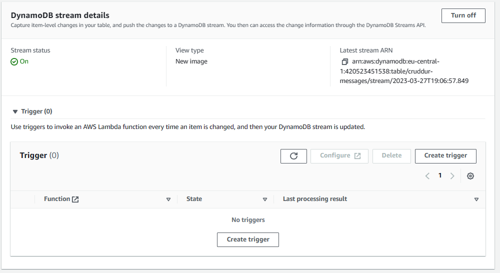
- add your function as a trigger on the stream 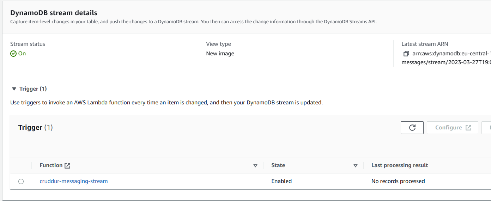
- grant the lambda IAM role permission to read the DynamoDB stream events `AWSLambdaInvocation-DynamoDB` 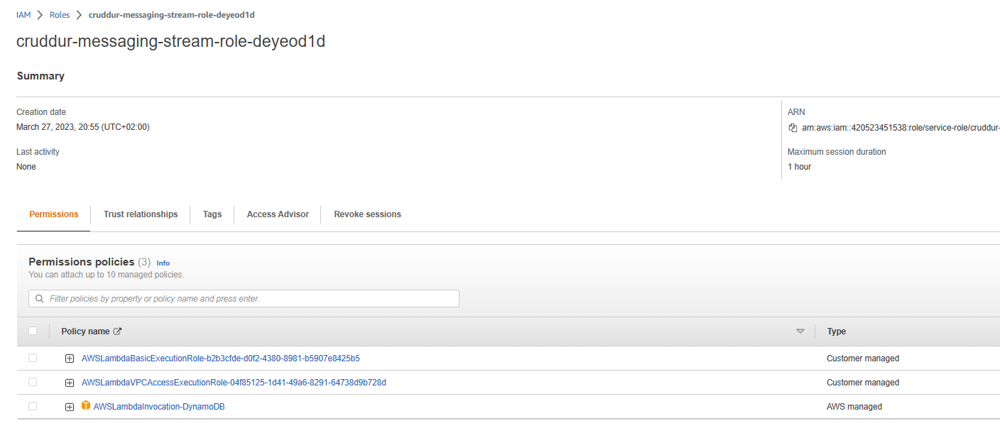
- grant the lambda IAM role permission to update table items (inline policy, not FullAccess) 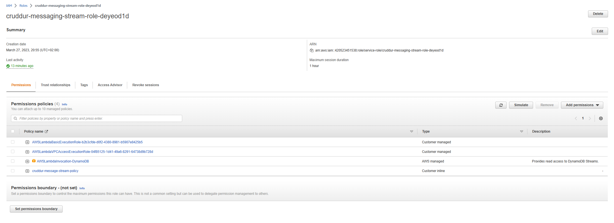

New message using prod DynamoDb:

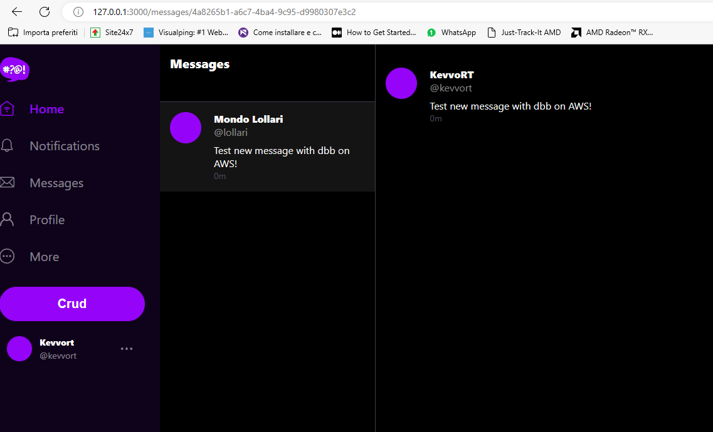


**The Function**

```.py
import json
import boto3
from boto3.dynamodb.conditions import Key, Attr

dynamodb = boto3.resource(
 'dynamodb',
 region_name='eu-central-1',
 endpoint_url="http://dynamodb.eu-central-1.amazonaws.com"
)

def lambda_handler(event, context):
  
  eventName = event['Records'][0]['eventName']
  if (eventName == 'REMOVE'):
    print("skip REMOVE event");
  return
  
  pk = event['Records'][0]['dynamodb']['Keys']['pk']['S']
  sk = event['Records'][0]['dynamodb']['Keys']['sk']['S']
  if pk.startswith('MSG#'):
    group_uuid = pk.replace("MSG#","")
    message = event['Records'][0]['dynamodb']['NewImage']['message']['S']
    print("GRUP ===>",group_uuid,message)
    
    table_name = 'cruddur-messages'
    index_name = 'message-group-sk-index'
    table = dynamodb.Table(table_name)
    data = table.query(
      IndexName=index_name,
      KeyConditionExpression=Key('message_group_uuid').eq(group_uuid)
    )
    print("RESP ===>",data['Items'])
    
    # recreate the message group rows with new SK value
    for i in data['Items']:
      delete_item = table.delete_item(Key={'pk': i['pk'], 'sk': i['sk']})
      print("DELETE ===>",delete_item)
      
      response = table.put_item(
        Item={
          'pk': i['pk'],
          'sk': sk,
          'message_group_uuid':i['message_group_uuid'],
          'message':message,
          'user_display_name': i['user_display_name'],
          'user_handle': i['user_handle'],
          'user_uuid': i['user_uuid']
        }
      )
      print("CREATE ===>",response)
```

## Proofs

Schema load proof:


Schema load+list tables proof:


Drop:


Seeds:


Scan:


Get conversations:


Get users from Cognito via AWS CLI:

```
aws cognito-idp list-users --user-pool-id=eu-central-1_YHvgublvA --region=eu-central-1 
```
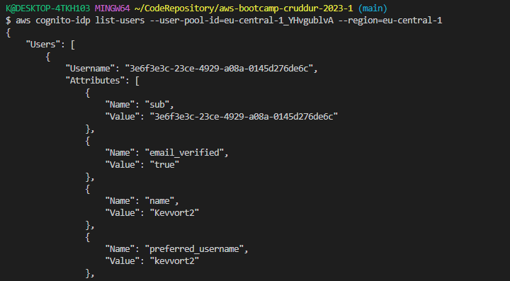

Get users from Cognito via AWS SDK (boto3):

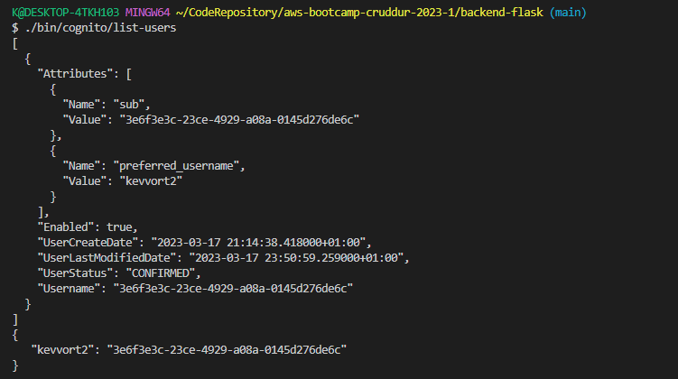

Update Cognito user ids programmatically:

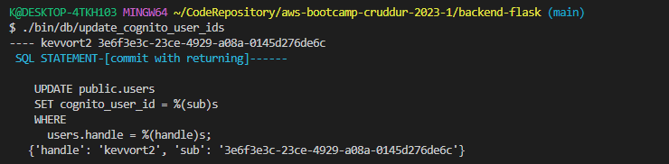

Get group messages:

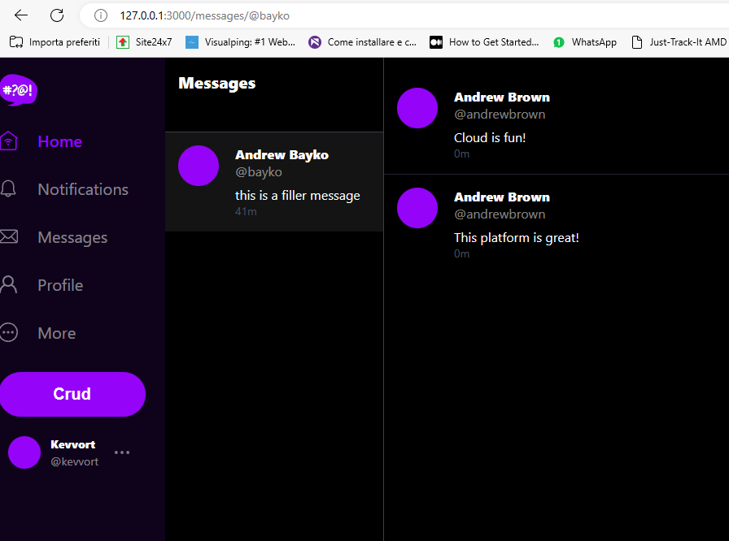

Get group messages and messages:

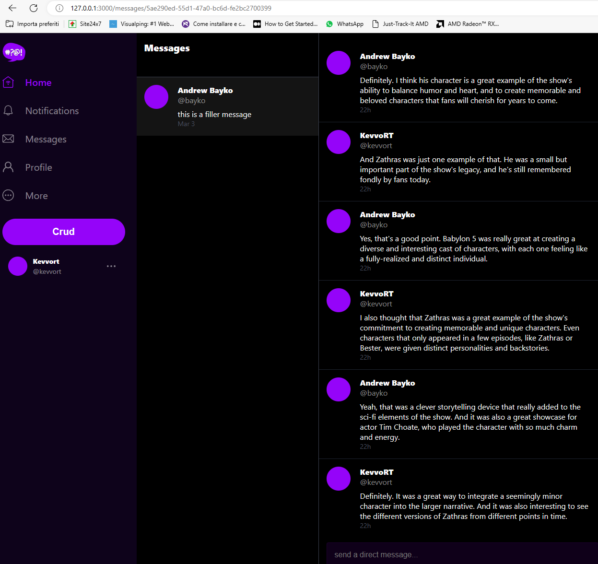

Reversed order:


Send a new message:

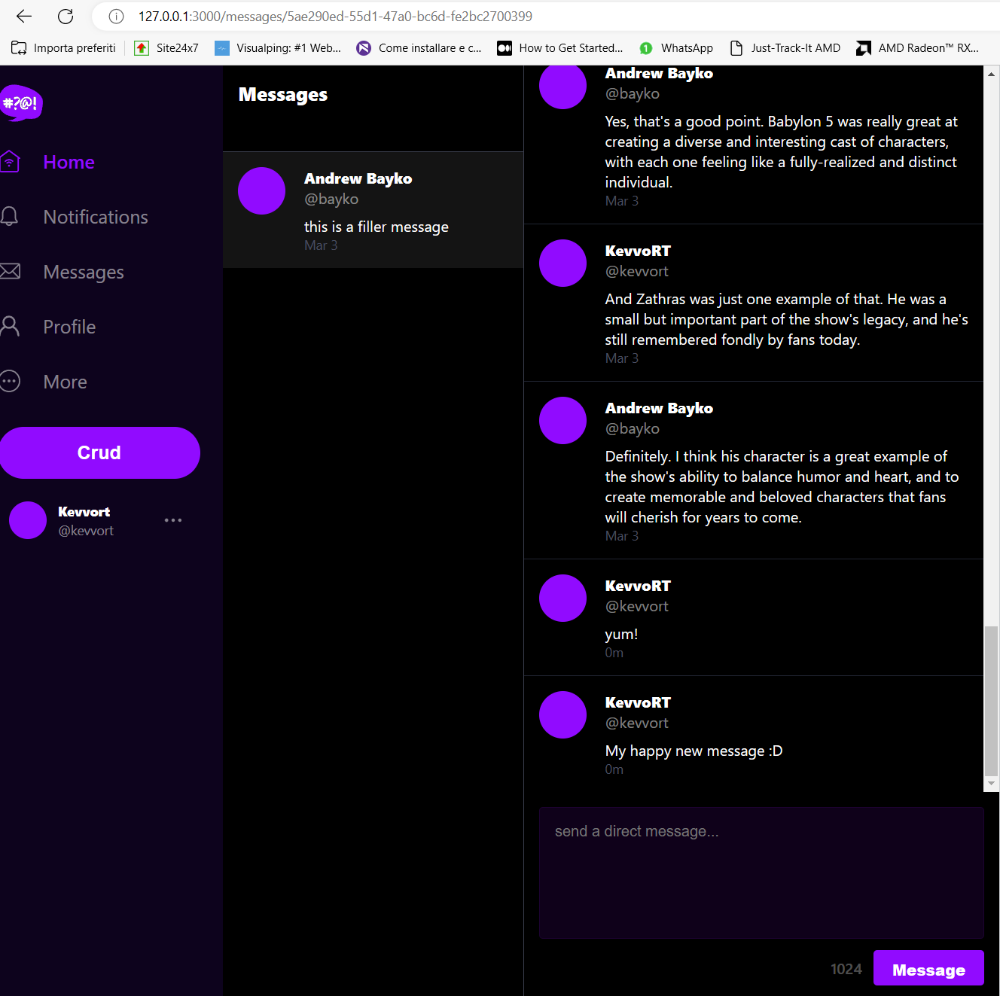

Add a new user for test purposes:

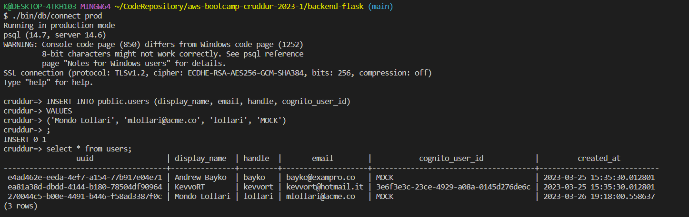

Check the new user simple data:

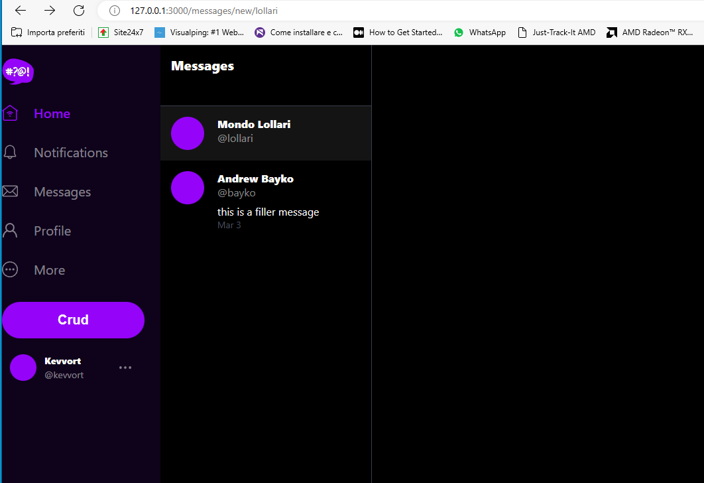

Send a new message in a new group:

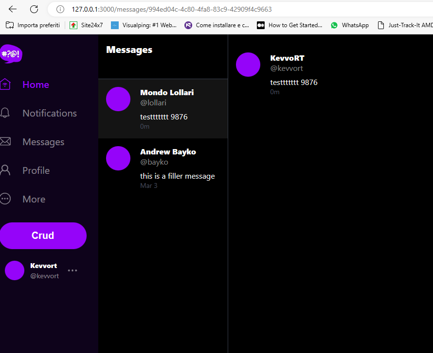

Final overview of the last message data on AWS:

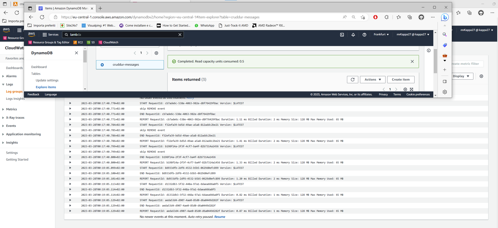

## Required Homeworks/Tasks
- Completed all the todo and technical tasks ✅ 
- Data Modelling a Direct Messaging System using Single Table Design ✅
- Implementing DynamoDB query using Single Table Design ✅
- Provisioning DynamoDB tables with Provisioned Capacity ✅
- Utilizing a Global Secondary Index (GSI) with DynamoDB ✅
- Rapid data modelling and implementation of DynamoDB with DynamoDB Local ✅
- Writing utility scripts to easily setup and teardown and debug DynamoDB data ✅
