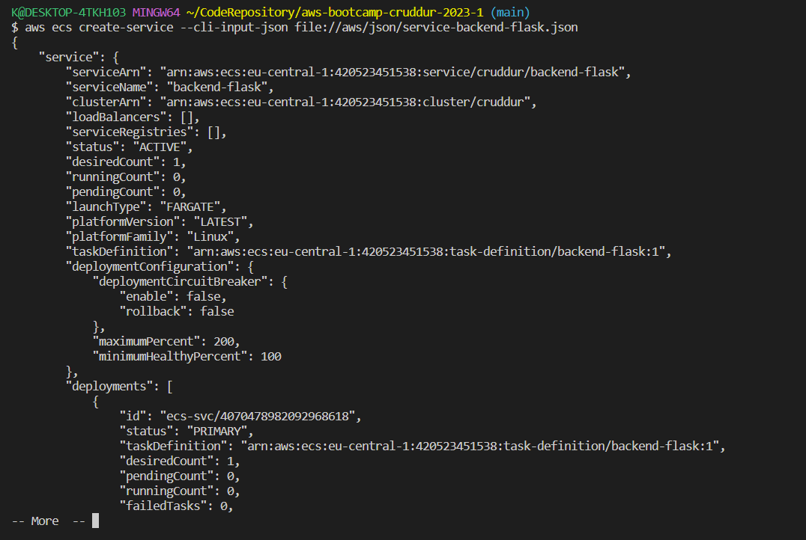

# Week 6 — Deploying Containers

## TL;DR

WIP

## Test RDS Connection

Add this `test` script into `db` so we can easily check our connection from our container.
This is helpful for healthchecks at application load balancer and container level.

```sh
#!/usr/bin/env python3

import psycopg
import os
import sys

connection_url = os.getenv("CONNECTION_URL")

conn = None
try:
  print('attempting connection')
  conn = psycopg.connect(connection_url)
  print("Connection successful!")
except psycopg.Error as e:
  print("Unable to connect to the database:", e)
finally:
  conn.close()
```


## Task Flask Script

We'll add the following endpoint for our flask app:

```py
@app.route('/api/health-check')
def health_check():
  return {'success': True}, 200
```

We'll create a new bin script at `bin/flask/health-check` and we want an `exit code` to inform the calling process about the result.

```py
#!/usr/bin/env python3

import urllib.request

try:
  response = urllib.request.urlopen('http://localhost:4567/api/health-check')
  if response.getcode() == 200:
    print("[OK] Flask server is running")
    exit(0) # success
  else:
    print("[BAD] Flask server is not running")
    exit(1) # false
# This for some reason is not capturing the error....
#except ConnectionRefusedError as e:
# so we'll just catch on all even though this is a bad practice
except Exception as e:
  print(e)
  exit(1) # false
```


## Create CloudWatch Log Group

```sh
aws logs create-log-group --log-group-name "cruddur/fargate-cluster"
aws logs put-retention-policy --log-group-name "cruddur/fargate-cluster" --retention-in-days 1
```


## Defaults

```sh
export DEFAULT_VPC_ID=$(aws ec2 describe-vpcs \
--filters "Name=isDefault, Values=true" \
--query "Vpcs[0].VpcId" \
--output text)
echo $DEFAULT_VPC_ID
```

```sh
export DEFAULT_SUBNET_IDS=$(aws ec2 describe-subnets  \
 --filters Name=vpc-id,Values=$DEFAULT_VPC_ID \
 --query 'Subnets[*].SubnetId' \
 --output json | jq -r 'join(",")')
echo $DEFAULT_SUBNET_IDS
```

## Create ECS Cluster

```sh
aws ecs create-cluster \
--cluster-name cruddur \
--service-connect-defaults namespace=cruddur
```


Not necessary due to the fact that we'll use Fargate:
```sh
export CRUD_CLUSTER_SG=$(aws ec2 create-security-group \
  --group-name cruddur-ecs-cluster-sg \
  --description "Security group for Cruddur ECS ECS cluster" \
  --vpc-id $DEFAULT_VPC_ID \
  --query "GroupId" --output text)
echo $CRUD_CLUSTER_SG
```

Get the Group ID (after its created)

```sh
export CRUD_CLUSTER_SG=$(aws ec2 describe-security-groups \
--group-names cruddur-ecs-cluster-sg \
--query 'SecurityGroups[0].GroupId' \
--output text)
```

## Gaining Access to ECS Fargate Container

## Create ECR repo and push image

### Login to ECR

```sh
aws ecr get-login-password --region $AWS_DEFAULT_REGION | docker login --username AWS --password-stdin "$AWS_ACCOUNT_ID.dkr.ecr.$AWS_DEFAULT_REGION.amazonaws.com"
```

### For Base-image python

```sh
aws ecr create-repository \
  --repository-name cruddur-python \
  --image-tag-mutability MUTABLE
```


#### Set URL

```sh
export ECR_PYTHON_URL="$AWS_ACCOUNT_ID.dkr.ecr.$AWS_DEFAULT_REGION.amazonaws.com/cruddur-python"
echo $ECR_PYTHON_URL
```

#### Pull Image

```sh
docker pull python:3.10-slim-buster
```

#### Tag Image

```sh
docker tag python:3.10-slim-buster $ECR_PYTHON_URL:3.10-slim-buster
```

#### Push Image

```sh
docker push $ECR_PYTHON_URL:3.10-slim-buster
```


### For Flask

In your flask dockerfile update the from to instead of using DockerHub's python image
you use your own eg.

> remember to put the :latest tag on the end

#### Create Repo
```sh
aws ecr create-repository \
  --repository-name backend-flask \
  --image-tag-mutability MUTABLE
```

#### Set URL

```sh
export ECR_BACKEND_FLASK_URL="$AWS_ACCOUNT_ID.dkr.ecr.$AWS_DEFAULT_REGION.amazonaws.com/backend-flask"
echo $ECR_BACKEND_FLASK_URL
```

#### Build Image
```sh
docker build -t backend-flask .
```

#### Tag Image

```sh
docker tag backend-flask:latest $ECR_BACKEND_FLASK_URL:latest
```

#### Push Image

```sh
docker push $ECR_BACKEND_FLASK_URL:latest
```


### For Frontend React

#### Create Repo
```sh
aws ecr create-repository \
  --repository-name frontend-react-js \
  --image-tag-mutability MUTABLE
```

#### Set URL

```sh
export ECR_FRONTEND_REACT_URL="$AWS_ACCOUNT_ID.dkr.ecr.$AWS_DEFAULT_REGION.amazonaws.com/frontend-react-js"
echo $ECR_FRONTEND_REACT_URL
```

#### Build Image

```sh
docker build \
--build-arg REACT_APP_BACKEND_URL="http://cruddur-alb-1946641671.eu-central-1.elb.amazonaws.com:4567" \
--build-arg REACT_APP_AWS_PROJECT_REGION="$AWS_DEFAULT_REGION" \
--build-arg REACT_APP_AWS_COGNITO_REGION="$AWS_DEFAULT_REGION" \
--build-arg REACT_APP_AWS_USER_POOLS_ID="eu-central-1_YHvgublvA" \
--build-arg REACT_APP_CLIENT_ID="6ae6329hj6dunhhv5j2i4knkhp" \
-t frontend-react-js \
-f Dockerfile.prod \
.
```

#### Tag Image

```sh
docker tag frontend-react-js:latest $ECR_FRONTEND_REACT_URL:latest
```

#### Push Image

```sh
docker push $ECR_FRONTEND_REACT_URL:latest
```


If you want to run and test it

```sh
docker run --rm -p 3000:3000 -it frontend-react-js 
```


## Register Task Defintions

### Passing Senstive Data to Task Definition

https://docs.aws.amazon.com/AmazonECS/latest/developerguide/specifying-sensitive-data.html
https://docs.aws.amazon.com/AmazonECS/latest/developerguide/secrets-envvar-ssm-paramstore.html

```sh
aws ssm put-parameter --type "SecureString" --name " /cruddur/backend-flask/AWS_ACCESS_KEY_ID" --value $AWS_ACCESS_KEY_ID
aws ssm put-parameter --type "SecureString" --name " /cruddur/backend-flask/AWS_SECRET_ACCESS_KEY" --value $AWS_SECRET_ACCESS_KEY
aws ssm put-parameter --type "SecureString" --name " /cruddur/backend-flask/CONNECTION_URL" --value $PROD_CONNECTION_URL
aws ssm put-parameter --type "SecureString" --name " /cruddur/backend-flask/ROLLBAR_ACCESS_TOKEN" --value $ROLLBAR_ACCESS_TOKEN
aws ssm put-parameter --type "SecureString" --name " /cruddur/backend-flask/OTEL_EXPORTER_OTLP_HEADERS" --value "x-honeycomb-team=$HONEYCOMB_API_KEY"
```
> NOTE: I added a blank space before the name for avoiding git bash to automatically prepend the system path to the first `/`


### Create Task and Exection Roles for Task Defintion


#### Create ExecutionRole

```sh
aws iam create-role \
    --role-name CruddurServiceExecutionRole \
    --assume-role-policy-document "{
  \"Version\":\"2012-10-17\",
  \"Statement\":[{
    \"Action\":[\"sts:AssumeRole\"],
    \"Effect\":\"Allow\",
    \"Principal\":{
      \"Service\":[\"ecs-tasks.amazonaws.com\"]
    }
  }]
}"
```

```sh
aws iam create-role \
  --role-name CruddurServiceExecutionRole \
  --assume-role-policy-document file://aws/policies/service-assume-role-execution-policy.json
```

```sh
aws iam put-role-policy \
  --policy-name CruddurServiceExecutionPolicy \
  --role-name CruddurServiceExecutionRole \
  --policy-document "file://aws/policies/service-execution-policy.json"
```

```sh
aws iam attach-role-policy --policy-arn POLICY_ARN --role-name CruddurServiceExecutionRole
```

```json

       {
            "Sid": "VisualEditor0",
            "Effect": "Allow",
            "Action": "ssm:GetParameter",
            "Resource": "arn:aws:ssm:ca-central-1:387543059434:parameter/cruddur/backend-flask/*"
        }

```sh
aws iam attach-role-policy \
    --policy-arn arn:aws:iam::aws:policy/service-role/AmazonECSTaskExecutionRolePolicy \
    --role-name CruddurServiceExecutionRole
```

```json
{
  "Sid": "VisualEditor0",
  "Effect": "Allow",
  "Action": [
    "ssm:GetParameters",
    "ssm:GetParameter"
  ],
  "Resource": "arn:aws:ssm:ca-central-1:387543059434:parameter/cruddur/backend-flask/*"
}
```

#### Create TaskRole

```sh
aws iam create-role \
    --role-name CruddurTaskRole \
    --assume-role-policy-document "{
  \"Version\":\"2012-10-17\",
  \"Statement\":[{
    \"Action\":[\"sts:AssumeRole\"],
    \"Effect\":\"Allow\",
    \"Principal\":{
      \"Service\":[\"ecs-tasks.amazonaws.com\"]
    }
  }]
}"

aws iam put-role-policy \
  --policy-name SSMAccessPolicy \
  --role-name CruddurTaskRole \
  --policy-document "{
  \"Version\":\"2012-10-17\",
  \"Statement\":[{
    \"Action\":[
      \"ssmmessages:CreateControlChannel\",
      \"ssmmessages:CreateDataChannel\",
      \"ssmmessages:OpenControlChannel\",
      \"ssmmessages:OpenDataChannel\"
    ],
    \"Effect\":\"Allow\",
    \"Resource\":\"*\"
  }]
}
"

aws iam attach-role-policy --policy-arn arn:aws:iam::aws:policy/CloudWatchFullAccess --role-name CruddurTaskRole
aws iam attach-role-policy --policy-arn arn:aws:iam::aws:policy/AWSXRayDaemonWriteAccess --role-name CruddurTaskRole
```


### Create Json file
Create a new folder called `aws/task-defintions` and place the following files in there:

> NOTE: Remember to replace and adapt the file with your values

`backend-flask.json`

```json
{
  "family": "backend-flask",
  "executionRoleArn": "arn:aws:iam::AWS_ACCOUNT_ID:role/CruddurServiceExecutionRole",
  "taskRoleArn": "arn:aws:iam::AWS_ACCOUNT_ID:role/CruddurTaskRole",
  "networkMode": "awsvpc",
  "containerDefinitions": [
    {
      "name": "backend-flask",
      "image": "BACKEND_FLASK_IMAGE_URL",
      "cpu": 256,
      "memory": 512,
      "essential": true,
      "portMappings": [
        {
          "name": "backend-flask",
          "containerPort": 4567,
          "protocol": "tcp", 
          "appProtocol": "http"
        }
      ],
      "logConfiguration": {
        "logDriver": "awslogs",
        "options": {
            "awslogs-group": "cruddur",
            "awslogs-region": "ca-central-1",
            "awslogs-stream-prefix": "backend-flask"
        }
      },
      "environment": [
        {"name": "OTEL_SERVICE_NAME", "value": "backend-flask"},
        {"name": "OTEL_EXPORTER_OTLP_ENDPOINT", "value": "https://api.honeycomb.io"},
        {"name": "AWS_COGNITO_USER_POOL_ID", "value": ""},
        {"name": "AWS_COGNITO_USER_POOL_CLIENT_ID", "value": ""},
        {"name": "FRONTEND_URL", "value": ""},
        {"name": "BACKEND_URL", "value": ""},
        {"name": "AWS_DEFAULT_REGION", "value": ""}
      ],
      "secrets": [
        {"name": "AWS_ACCESS_KEY_ID"    , "valueFrom": "arn:aws:ssm:AWS_REGION:AWS_ACCOUNT_ID:parameter/cruddur/backend-flask/AWS_ACCESS_KEY_ID"},
        {"name": "AWS_SECRET_ACCESS_KEY", "valueFrom": "arn:aws:ssm:AWS_REGION:AWS_ACCOUNT_ID:parameter/cruddur/backend-flask/AWS_SECRET_ACCESS_KEY"},
        {"name": "CONNECTION_URL"       , "valueFrom": "arn:aws:ssm:AWS_REGION:AWS_ACCOUNT_ID:parameter/cruddur/backend-flask/CONNECTION_URL" },
        {"name": "ROLLBAR_ACCESS_TOKEN" , "valueFrom": "arn:aws:ssm:AWS_REGION:AWS_ACCOUNT_ID:parameter/cruddur/backend-flask/ROLLBAR_ACCESS_TOKEN" },
        {"name": "OTEL_EXPORTER_OTLP_HEADERS" , "valueFrom": "arn:aws:ssm:AWS_REGION:AWS_ACCOUNT_ID:parameter/cruddur/backend-flask/OTEL_EXPORTER_OTLP_HEADERS" }
        
      ]
    }
  ]
}
```

`frontend-react.json`

```json
{
  "family": "frontend-react-js",
  "executionRoleArn": "arn:aws:iam::420523451538:role/CruddurServiceExecutionRole",
  "taskRoleArn": "arn:aws:iam::420523451538:role/CruddurTaskRole",
  "networkMode": "awsvpc",
  "containerDefinitions": [
    {
      "name": "frontend-react-js",
      "image": "420523451538.dkr.ecr.eu-central-1.amazonaws.com/frontend-react-js:latest",
      "cpu": 256,
      "memory": 256,
      "essential": true,
      "portMappings": [
        {
          "name": "frontend-react-js",
          "containerPort": 3000,
          "protocol": "tcp", 
          "appProtocol": "http"
        }
      ],

      "logConfiguration": {
        "logDriver": "awslogs",
        "options": {
            "awslogs-group": "cruddur",
            "awslogs-region": "eu-central-1",
            "awslogs-stream-prefix": "frontend-react"
        }
      }
    }
  ]
}
```

### Register Task Defintion

```sh
aws ecs register-task-definition --cli-input-json file://aws/task-definitions/backend-flask.json
```


```sh
aws ecs register-task-definition --cli-input-json file://aws/task-definitions/frontend-react-js.json
```

### Create Security Group


```sh
export CRUD_SERVICE_SG=$(aws ec2 create-security-group \
  --group-name "crud-srv-sg" \
  --description "Security group for Cruddur services on ECS" \
  --vpc-id $DEFAULT_VPC_ID \
  --query "GroupId" --output text)
echo $CRUD_SERVICE_SG
```


```sh
aws ec2 authorize-security-group-ingress \
  --group-id $CRUD_SERVICE_SG \
  --protocol tcp \
  --port 4567 \
  --cidr 0.0.0.0/0
```


> if we need to get the sg group id  again
```sh
export CRUD_SERVICE_SG=$(aws ec2 describe-security-groups \
  --filters Name=group-name,Values=crud-srv-sg \
  --query 'SecurityGroups[*].GroupId' \
  --output text)
```


#### Update RDS SG to allow access for the last security group

```sh
aws ec2 authorize-security-group-ingress \
  --group-id $DB_SG_ID \
  --protocol tcp \
  --port 5432 \
  --source-group $CRUD_SERVICE_SG \
  --tag-specifications 'ResourceType=security-group,Tags=[{Key=Name,Value=BACKENDFLASK}]'
```

### Create Services

```sh
aws ecs create-service --cli-input-json file://aws/json/service-backend-flask.json
```




```sh
aws ecs create-service --cli-input-json file://aws/json/service-frontend-react-js.json
```


> Auto Assign is not supported by EC2 launch type for services

This is for when we are uing a NetworkMode of awsvpc
> --network-configuration "awsvpcConfiguration={subnets=[$DEFAULT_SUBNET_IDS],securityGroups=[$SERVICE_CRUD_SG],assignPublicIp=ENABLED}"

https://docs.aws.amazon.com/AmazonECS/latest/developerguide/task-networking.html

### Test Service

Use sessions manager to connect to the Fargate instance.

#### Test RDS Connection

Shell into the backend flask container and run the `./bin/db/test` script to ensure we have a database connection

#### Test Flask App is running

`./bin/flask/health-check`

Check our forwarding ports for the container

```sh
docker port <CONTAINER_ID>
```

> docker run --rm --link <container_name_or_id>:<alias> curlimages/curl curl <alias>:<port>/<endpoint>

```sh
docker run --rm --link d71eea0b8e93:flask -it curlimages/curl --get -H "Accept: application/json" -H "Content-Type: application/json" http://flask:4567/api/activities/home
```

#### Check endpoint against Public IP 

```sh
docker run --rm -it curlimages/curl --get -H "Accept: application/json" -H "Content-Type: application/json" http://3.97.113.133/api/activities/home
```


## Not able to use Sessions Manager to get into cluster EC2 sintance

The instance can hang up for various reasons.
You need to reboot and it will force a restart after 5 minutes
So you will have to wait 5 minutes or after a timeout.

You have to use the AWS CLI. 
You can't use the AWS Console. it will not work as expected.

The console will only do a graceful shutdodwn
The CLI will do a forceful shutdown after a period of time if graceful shutdown fails.

```sh
aws ec2 reboot-instances --instance-ids i-0d15aef0618733b6d
```
 
 ### Connection via Sessions Manaager (Fargate)
 
 Connect to an ECS task. Useful for debugging.

 https://docs.aws.amazon.com/systems-manager/latest/userguide/session-manager-working-with-install-plugin.html#install-plugin-linux
 https://docs.aws.amazon.com/systems-manager/latest/userguide/session-manager-working-with-install-plugin.html#install-plugin-verify
 
 Install for Ubuntu
 ```sh
 curl "https://s3.amazonaws.com/session-manager-downloads/plugin/latest/ubuntu_64bit/session-manager-plugin.deb" -o "session-manager-plugin.deb"
 sudo dpkg -i session-manager-plugin.deb
 ```
 
 Verify its working
 ```sh
 session-manager-plugin
 ```
 
Connect to the container
 ```sh
aws ecs execute-command  \
--region $AWS_DEFAULT_REGION \
--cluster cruddur \
--task dceb2ebdc11c49caadd64e6521c6b0c7 \
--container backend-flask \
--command "/bin/bash" \
--interactive
```

 ```sh
docker run -rm \
-p 4567:4567 \
-e AWS_ENDPOINT_URL="http://dynamodb-local:8000" \
-e CONNECTION_URL="postgresql://postgres:password@db:5432/cruddur" \
-e FRONTEND_URL="https://3000-${GITPOD_WORKSPACE_ID}.${GITPOD_WORKSPACE_CLUSTER_HOST}" \
-e BACKEND_URL="https://4567-${GITPOD_WORKSPACE_ID}.${GITPOD_WORKSPACE_CLUSTER_HOST}" \
-e OTEL_SERVICE_NAME='backend-flask' \
-e OTEL_EXPORTER_OTLP_ENDPOINT="https://api.honeycomb.io" \
-e OTEL_EXPORTER_OTLP_HEADERS="x-honeycomb-team=${HONEYCOMB_API_KEY}" \
-e AWS_XRAY_URL="*4567-${GITPOD_WORKSPACE_ID}.${GITPOD_WORKSPACE_CLUSTER_HOST}*" \
-e AWS_XRAY_DAEMON_ADDRESS="xray-daemon:2000" \
-e AWS_DEFAULT_REGION="${AWS_DEFAULT_REGION}" \
-e AWS_ACCESS_KEY_ID="${AWS_ACCESS_KEY_ID}" \
-e AWS_SECRET_ACCESS_KEY="${AWS_SECRET_ACCESS_KEY}" \
-e ROLLBAR_ACCESS_TOKEN="${ROLLBAR_ACCESS_TOKEN}" \
-e AWS_COGNITO_USER_POOL_ID="${AWS_COGNITO_USER_POOL_ID}" \
-e AWS_COGNITO_USER_POOL_CLIENT_ID="5b6ro31g97urk767adrbrdj1g5" \   
-it backend-flask-prod
 ```


 ## Required Homeworks/Tasks
- Completed all the todo and technical tasks ✅ 


- Created application load balancer (ALB) and two target groups, one for the backend and one for the frontend:


ECS Task healthcheck from both Target Group and internal check:


Reaching our backend service from the ALB:


I've skipped the part about ALB access logging for spending concerns.

 ## Required Homeworks/Tasks
- Create a ECR registry for the frontend