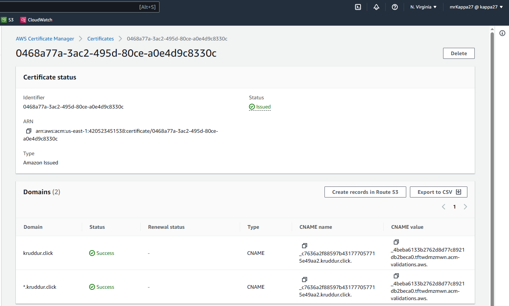
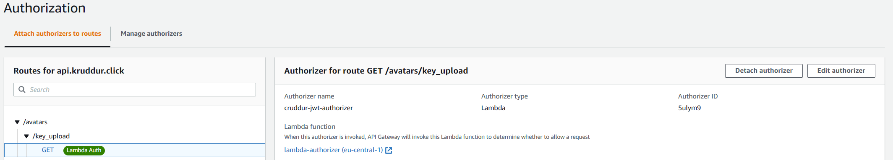

# Week 8 — Serverless Image Processing

## TL;DR

- Followed the videos 
- Followed the live
- Completed the todolist

Interesting week, especially what we did on rendering with Cloudfront and the main challenge has been tinkering with Ruby + presigned URLs, these URLs tend to be tricky sometimes, and working with the frontend is quite challenging because there are a lot of things to care about. 

## New Directory

Lets contain our cdk pipeline in a new top level directory called:

```sh
cd /workspace/aws-bootcamp-cruddur-2023
mkdir thumbing-serverless-cdk
```

## Install CDK globally

This is so we can use the AWS CDK CLI for anywhere.

```sh
npm install aws-cdk -g
```


## Initialize a new project

We'll initialize a new cdk project within the folder we created:

```sh
cdk init app --language typescript
```

## Add an S3 Bucket

Add the following code to your `thumbing-serverless-cdk-stack.ts`

```ts
import * as s3 from 'aws-cdk-lib/aws-s3';

const bucketName: string = process.env.THUMBING_BUCKET_NAME as string;

const bucket = new s3.Bucket(this, 'ThumbingBucket', {
  bucketName: bucketName,
  removalPolicy: cdk.RemovalPolicy.DESTROY,
});
```
> REMEBER: bucket names MUST be globally unique!

```sh
export THUMBING_BUCKET_NAME="kruddur-thumbs"
gp env THUMBING_BUCKET_NAME="kruddur-thumbs"
```

- [Bucket Construct](https://docs.aws.amazon.com/cdk/api/v2/docs/aws-cdk-lib.aws_s3.Bucket.html)
- [Removal Policy](https://docs.aws.amazon.com/cdk/api/v1/docs/@aws-cdk_core.RemovalPolicy.html)

## Bootstrapping

> Deploying stacks with the AWS CDK requires dedicated Amazon S3 buckets and other containers to be available to AWS CloudFormation during deployment. 

```sh
cdk bootstrap "aws://$AWS_ACCOUNT_ID/$AWS_DEFAULT_REGION"
```


## Build

We can use build to catch errors prematurely.
This jsut builds tyescript

```sh
npm run build
```

## Synth

> the synth command is used to synthesize the AWS CloudFormation stack(s) that represent your infrastructure as code.

```sh
cdk synth
```


## Deploy

```sh
cdk deploy
```


## List Stacks

```sh
cdk ls
```

## Load Env Vars
  ```ts
const dotenv = require('dotenv');
dotenv.config();

const bucketName: string = process.env.THUMBING_BUCKET_NAME as string;
const folderInput: string = process.env.THUMBING_S3_FOLDER_INPUT as string;
const folderOutput: string = process.env.THUMBING_S3_FOLDER_OUTPUT as string;
const webhookUrl: string = process.env.THUMBING_WEBHOOK_URL as string;
const topicName: string = process.env.THUMBING_TOPIC_NAME as string;
const functionPath: string = process.env.THUMBING_FUNCTION_PATH as string;
console.log('bucketName',bucketName)
console.log('folderInput',folderInput)
console.log('folderOutput',folderOutput)
console.log('webhookUrl',webhookUrl)
console.log('topicName',topicName)
console.log('functionPath',functionPath)
```

## Create Bucket

```ts
import * as s3 from 'aws-cdk-lib/aws-s3';

const bucket = this.createBucket(bucketName)

createBucket(bucketName: string): s3.IBucket {
  const logicalName: string = 'ThumbingBucket';
  const bucket = new s3.Bucket(this, logicalName , {
    bucketName: bucketName,
    removalPolicy: cdk.RemovalPolicy.DESTROY,
  });
  return bucket;
}
```

## Create Lambda

```ts
import * as lambda from 'aws-cdk-lib/aws-lambda';

const lambda = this.createLambda(folderInput,folderOutput,functionPath,bucketName)

createLambda(folderIntput: string, folderOutput: string, functionPath: string, bucketName: string): lambda.IFunction {
  const logicalName = 'ThumbLambda';
  const code = lambda.Code.fromAsset(functionPath)
  const lambdaFunction = new lambda.Function(this, logicalName, {
    runtime: lambda.Runtime.NODEJS_18_X,
    handler: 'index.handler',
    code: code,
    environment: {
      DEST_BUCKET_NAME: bucketName,
      FOLDER_INPUT: folderIntput,
      FOLDER_OUTPUT: folderOutput,
      PROCESS_WIDTH: '512',
      PROCESS_HEIGHT: '512'
    }
  });
  return lambdaFunction;
}
```

## Create SNS Topic

```ts
import * as sns from 'aws-cdk-lib/aws-sns';

const snsTopic = this.createSnsTopic(topicName)

createSnsTopic(topicName: string): sns.ITopic{
  const logicalName = "Topic";
  const snsTopic = new sns.Topic(this, logicalName, {
    topicName: topicName
  });
  return snsTopic;
}
```

## Create an SNS Subscription

```ts
import * as s3n from 'aws-cdk-lib/aws-s3-notifications';

this.createSnsSubscription(snsTopic,webhookUrl)

createSnsSubscription(snsTopic: sns.ITopic, webhookUrl: string): sns.Subscription {
  const snsSubscription = snsTopic.addSubscription(
    new subscriptions.UrlSubscription(webhookUrl)
  )
  return snsSubscription;
}
```

## Create S3 Event Notification to SNS

```ts
this.createS3NotifyToSns(folderOutput,snsTopic,bucket)

createS3NotifyToSns(prefix: string, snsTopic: sns.ITopic, bucket: s3.IBucket): void {
  const destination = new s3n.SnsDestination(snsTopic)
  bucket.addEventNotification(
    s3.EventType.OBJECT_CREATED_PUT, 
    destination,
    {prefix: prefix}
  );
}
```

## Create S3 Event Notification to Lambda

```ts
this.createS3NotifyToLambda(folderInput,laombda,bucket)

createS3NotifyToLambda(prefix: string, lambda: lambda.IFunction, bucket: s3.IBucket): void {
  const destination = new s3n.LambdaDestination(lambda);
    bucket.addEventNotification(s3.EventType.OBJECT_CREATED_PUT,
    destination,
    {prefix: prefix}
  )
}
```

## Create Policy for Bucket Access

```ts
const s3ReadWritePolicy = this.createPolicyBucketAccess(bucket.bucketArn)
```

## Create Policy for SNS Publishing

```ts
const snsPublishPolicy = this.createPolicySnSPublish(snsTopic.topicArn)
```

## Attach the Policies to the Lambda Role

```ts
lambda.addToRolePolicy(s3ReadWritePolicy);
lambda.addToRolePolicy(snsPublishPolicy);
```

Stack deployed:


Avatar serverless resize:


Avatar resize SNS notification configured:

## Cloudfront

Cloudfront is the AWS Content Delivery Network.
We Use the CDN for caching the avatars so we can reduce requests to our origin, serve faster our content and save some money.

> Create the ACM certificate in us-east-1 for having it available on Cloudfront!



Add an Alias CNAME record in our hosted zone to our distribution:


Update the source S3 bucket (origin) policy with the one suggested from Cloudfront:


Testing the CDN:


Then we separated the source and destination buckets for not having publicly available the source images and for better future scaling and separation of the S3 buckets:


## Implement Users Profile Page

We are going to implement a dedicated user profile page.
For doing that we need to work on both backend, frontend and minor tooling files.
Finally we've to adapt the database structure for keeping track of the new infos.

Here an example of the real user profile API (not anymore mocked):


Mainly we worked on how to show and manage this feature based on conditionals showing buttons/options and improving API:


## Implement Migrations Backend Endpoint and Profile Form

We're going to create the Profile Form and, for doing that, we need to change our database structure.
Using the migration approach is a common way for handling database structure changes in a programmatic way, a lot of frameworks have a built in migration management.
Basically you define a migration as a set of changes to be applied to your database in a controlled way, for example you could also insert some logic before changing the database.
Usually you apply migrations for evolving your database structure but, having them as code, you can also "rollback" to the previous database state, this action is usually known as "migrate down" as opposed to "migrate up".

We'll use migrations for adding the `bio` column in the `user` table.

Add migration table and run migration:


Profile updated:


## Presigned URL generation via Ruby Lambda

In this section we're going to implement a Ruby Lambda called `cruddur-upload-avatar` for generating a S3 Presigned URL.
A presigned URL gives you access to the object identified in the URL, provided that the creator of the presigned URL has permissions to access that object.
For further info see this [link](https://docs.aws.amazon.com/AmazonS3/latest/userguide/PresignedUrlUploadObject.html)

The benefit of using this solution is to offload the upload process from the server and let it be done directly from the client.
The only thing the server has to handle is the URL generation then, the client, will use that URL for uploading the content directly to S3.

Presigned URLs can also be used for downloading an object and we can also use cookies for managing the access.

Test locally the Ruby code:

```sh
bundle exec ruby function.rb
```

> Use Postman for testing the URL

If necesary we can set a S3 lifecycle rule for deleting objects after a certain amount of time.

> Remember to add the UPLOADS_BUCKET_NAME ENV VAR!

Here the tested function output:


## HTTP API Gateway with Lambda Authorizer	

For doing that we need to create an API endpoint, which triggers our Lambda that returns our presigned URL to the frontend.

This requests must be validated so only our allowed users are capable of fetching the signed URL.
For doing that validation we'll write a dedicated Lambda called `lambda-authorizer`, this Lambda will validate the Bearer Token in the request.

> For uploading this Lambda to the console we've to zip it with the command `zip -r lambda_authorizer.zip .`

> Add environment variables USER_POOL_ID and CLIENT_ID

Create the API Gateway:


Configure the authorization:



> Configure CORS on the API Gateway to allow POST and OPTIONS methods and the ORIGIN (remember to add it, bad UI!)


## Required Homeworks/Tasks
- Completed all the todo and technical tasks ✅ 
- Implement CDK Stack	✅ 
- Serve Avatars via CloudFront ✅
- Implement Users Profile Page	✅
- Implement Users Profile Form ✅
- Implement Backend Migrations ✅
- Presigned URL generation via Ruby Lambda ✅
- HTTP API Gateway with Lambda Authorizer	✅
- Create JWT Lambda Layer	✅
- Render Avatars in App via CloudFront