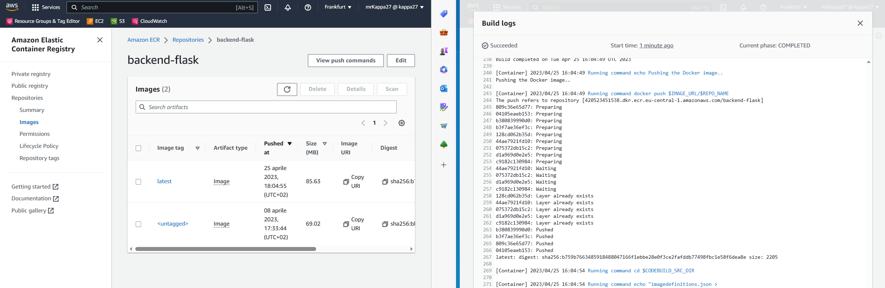
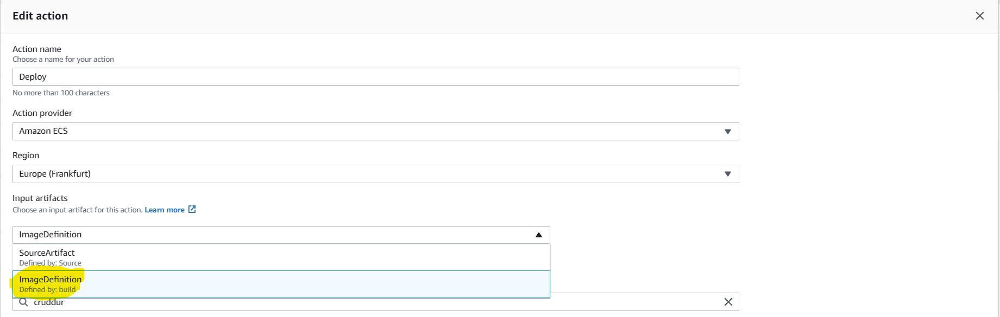
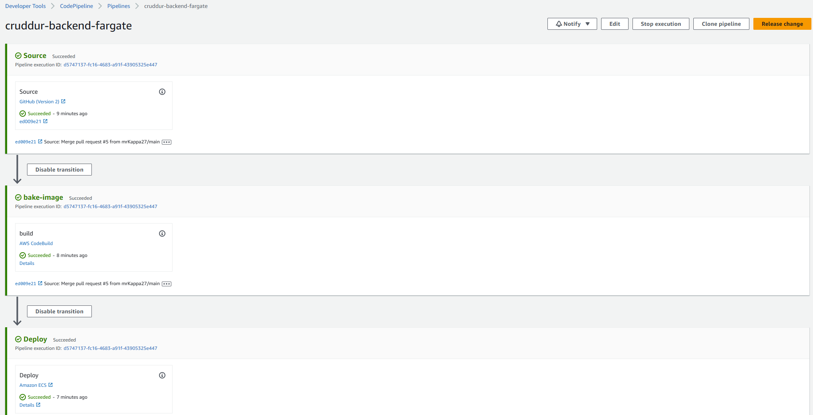
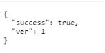

# Week 9 — CI/CD with CodePipeline, CodeBuild and CodeDeploy

## TL;DR

- Followed the videos 
- Followed the live
- Completed the todolist

This week has been pretty straightforward and more focused. I didn't have particular issues because I've also already used CodeBuild and CodePipeline in similar scenarios at work.

##	CICD Pipeline Security

Key concepts:

- Check your secrets
- Check known open source vulnerabilities in the code
- Run static and/or dynamic code analysis 
- Check if the AWS security services are available in your region
- Enable and check: Amazon Organization SCP, Cloudtrail, GuardDuty and ConfigRule
- Check your pipeline from IAM to container registry for weak points
- Make impossibile to bypass the pipeline if you want to deploy to production
- Take advantage of TLS/SSL certs for in transit traffic
- Continuosly check if there's a change that may alter the known state of a CI/CD pipeline

## Configuring CodeBuild

AWS CodeBuild is a fully managed continuous integration service that compiles source code, runs tests, and produces ready-to-deploy software packages.

Codebuild follows what's written in a special file called `buildspec.yml` in the root of your project, this file containes the "recipe" for compiling/builgin/testing your project. You can override this default file name with a custom one.
You can both build in a dedicated build instance with and without Docker support.

> Remember to enable Docker while you are creating the build project.

When you're building you can use specific `ENV_VARs` that will help you during the build.

Here the reference [documentation](https://docs.aws.amazon.com/codebuild/latest/userguide/build-spec-ref.html).

Do not set your environment to use VPC in this scenario, we need to be able to reach other services like ECR.

> Check you ECR base images access policies. I had to update them for allowing the codebuild role to access the base image repository.

## Configuring CodePipeline

AWS CodePipeline is a fully managed continuous delivery service that helps you automate your release pipelines for fast and reliable application and infrastructure updates.

Let's create a pipeline for our backend:

Connect our CodePipeline to our GitHub using version 2 connector.

Create a dedicated branch called `prod` as source for our pipeline.

Set our ECS beackend-flask as deploy target:

Create a build project for backend flask for using it in our build stage in the pipeline:

For triggering a build in our pipeline we've to merge our code to the specific source branch called `prod`:

In the build stage the output artifact will be called `ImageDefinition` and that will be set as the input artifact of the deploy to ECS stage.

We'll introduce a `version: 1` in the health API for testing the pipeline.

Pipeline completed successfully:

Change applied automatically via the pipeline:

## Required Homeworks/Tasks
- Completed all the todo and technical tasks ✅ 
- Configure CodeBuild Project ✅
- Configure CodePipeline ✅
- Create a buildspec.yml file ✅