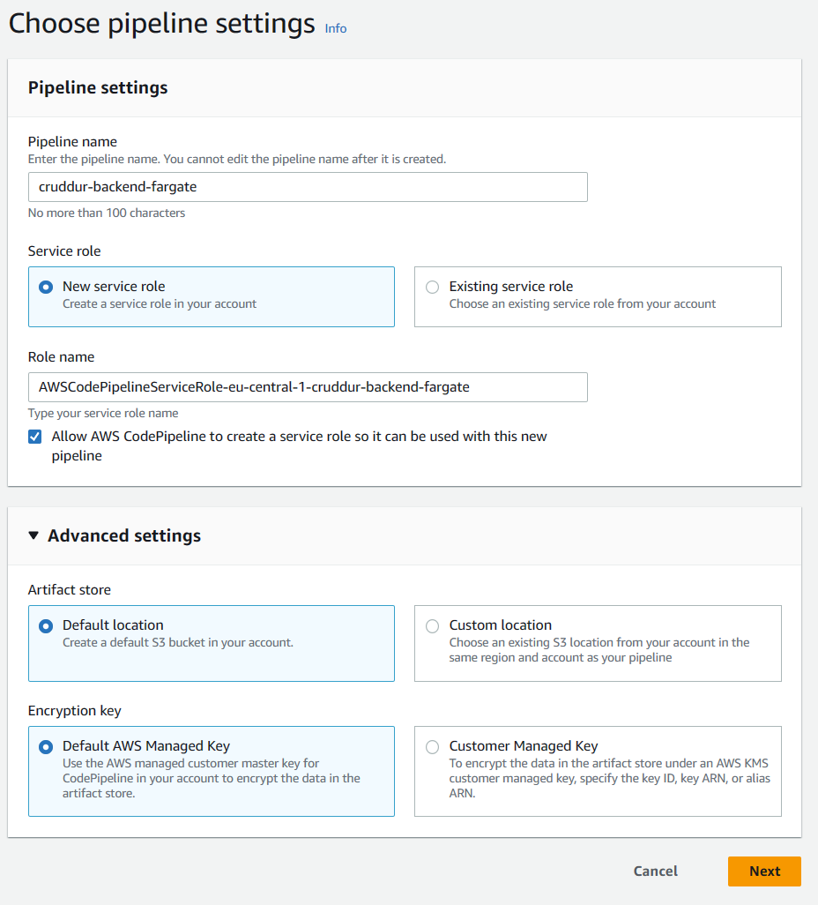

# Week 9 — CI/CD with CodePipeline, CodeBuild and CodeDeploy

## TL;DR

- Followed the videos 
- Followed the live
- Completed the todolist

This week has been pretty straightforward and more focused. I didn't have particular issues because I've also already used CodeBuild and CodePipeline in similar scenarios at work.

##	CICD Pipeline Security

## Configuring CodeBuild

AWS CodeBuild is a fully managed continuous integration service that compiles source code, runs tests, and produces ready-to-deploy software packages.

Codebuild follows what's written in a special file called `buildspec.yml` in the root of your project, this file containes the "recipe" for compiling/builgin/testing your project. You can override this default file name with a custom one.
You can both build in a dedicated build instance with and without Docker support.

> Remember to enable Docker while you are creaing the build project.

When you're building you can use specific `ENV_VARs` that will help you during the build.

Here the reference [documentation](https://docs.aws.amazon.com/codebuild/latest/userguide/build-spec-ref.html).

## Configuring CodePipeline

AWS CodePipeline is a fully managed continuous delivery service that helps you automate your release pipelines for fast and reliable application and infrastructure updates.

Let's create a pipeline for our backend:

Connect our CodePipeline to our GitHub using version 2 connector.

Create a dedicated branch called `prod` as source for our pipeline.

> Temporary skip the build phase

Set our ECS beackend-flask as deploy target:

Create a build project for backend flask for using it in our build stage in the pipeline:

## Required Homeworks/Tasks
- Completed all the todo and technical tasks ✅ 
- Configuring CodeBuild Part 1
- Configuring CodeBuild Part 2
- Configuring CodePipeline